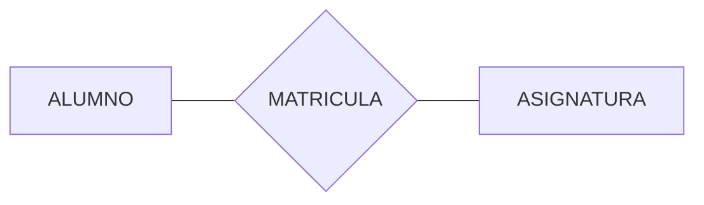

# Tema 1. Repaso Lenguaje SQL

## 1. `SQL` (Structured Query Language)

Es el lenguaje estándar para interactuar con bases de datos relacionales:

- **Definir** estructuras: bases de datos, esquemas, tablas, índices, vistas… (DDL).
- **Manipular** datos: insertar, actualizar, borrar y consultar (DML).
- **Controlar acceso**: conceder y revocar privilegios (DCL).

## 2. Data Definition Language (DDL)

DDL define la **estructura** (metadatos). Afecta a objetos: bases de datos, esquemas, tablas, columnas, tipos, claves, índices, vistas, etc.

### 2.1. Creación de bases de datos, tablas y otros objeto

#### 2.1.1. Crear una base de datos (según SGBD)

En algunos sistemas, `CREATE DATABASE` se ejecuta fuera del contexto de una BD:

```sql
CREATE DATABASE universidad;
```

En **MySQL**, tras crear la base de datos normalmente harías:

```sql
USE universidad;
```

En MySQL, el término **SCHEMA es sinónimo de DATABASE** (no existe “schema” como namespace independiente dentro de una base de datos, como en PostgreSQL).

#### 2.1.2. Crear tablas con claves y restricciones

Ejemplo didáctico: relación **N:N** entre *alumnos* y *asignaturas*, con la tabla intermedia *matrícula* que guarda la **nota**.



```sql
CREATE TABLE universidad.alumno (
  id_alumno      INT NOT NULL AUTO_INCREMENT,
  dni            VARCHAR(12) NOT NULL UNIQUE,
  nombre         VARCHAR(80) NOT NULL,
  email          VARCHAR(120) UNIQUE,
  fecha_alta     DATE NOT NULL DEFAULT (CURRENT_DATE),
  activo         BOOLEAN NOT NULL DEFAULT TRUE,
  PRIMARY KEY (id_alumno)
) ENGINE=InnoDB;
```

```sql
CREATE TABLE universidad.asignatura (
  id_asignatura  INT NOT NULL AUTO_INCREMENT,
  codigo         VARCHAR(12) NOT NULL UNIQUE,
  nombre         VARCHAR(120) NOT NULL,
  creditos       DECIMAL(3,1) NOT NULL,
  PRIMARY KEY (id_asignatura)
) ENGINE=InnoDB;
```

Tabla intermedia N:N con nota:

```sql
CREATE TABLE universidad.matricula (
  id_matricula   INT NOT NULL AUTO_INCREMENT,
  id_alumno      INT NOT NULL,
  id_asignatura  INT NOT NULL,
  curso          VARCHAR(9) NOT NULL,          -- p.ej. '2025-2026'
  fecha          DATE NOT NULL DEFAULT (CURRENT_DATE),
  nota           DECIMAL(4,2),
  CONSTRAINT fk_matricula_alumno
    FOREIGN KEY (id_alumno)
    REFERENCES universidad.alumno(id_alumno)
    ON UPDATE CASCADE
    ON DELETE RESTRICT,
  CONSTRAINT fk_matricula_asignatura
    FOREIGN KEY (id_asignatura)
    REFERENCES universidad.asignatura(id_asignatura)
    ON UPDATE CASCADE
    ON DELETE RESTRICT,
  UNIQUE (id_alumno, id_asignatura),
  PRIMARY KEY (id_matricula)
) ENGINE=InnoDB;
```

**Conceptos clave**

- **PK (Primary Key)**: identifica unívocamente una fila. Idealmente estable.
- **UNIQUE**: evita duplicados (p. ej. DNI).
- **NOT NULL**: obliga a tener valor (consistencia).
- **DEFAULT**: valor por defecto (reduce errores de carga).
- **FK (Foreign Key)**: integridad referencial.
  - `ON DELETE RESTRICT`: no deja borrar alumno si hay matrículas.
  - `ON DELETE CASCADE`: borraría en cascada (útil en tablas “hijas” puras, peligroso si no se entiende).
- Engine: `InnoDB` es el motor por defecto y es el que se usa en la mayoría de los casos. Hay otros motores como `MyISAM`, `Memory`, `CSV`, etc.

<details>
<summary><strong>Engines</strong></summary>

| Engine | Características | Pros | Contras |
|---|---|---|---|
| `InnoDB` | Transaccional (ACID), soporta FK, bloqueo a nivel de fila, recuperación ante fallos | Consistencia, concurrencia, opción por defecto recomendada | Puede requerir más configuración/tuning; mayor sobrecarga que motores no transaccionales |
| `MyISAM` | No transaccional, sin FK, bloqueo a nivel de tabla | Simple y rápido en lecturas específicas (casos legacy) | Riesgo de inconsistencias; sin transacciones; peor concurrencia; desaconsejado para aplicaciones modernas |
| `MEMORY` | Tablas en RAM (no persistentes), acceso muy rápido | Muy rápido para datos temporales/lookup pequeños | Se pierde al reiniciar; limitado por RAM; cuidado con tipos/índices y tamaño |
| `CSV` | Cada tabla como fichero CSV (texto) | Útil para intercambio/importación/exportación sencilla | Muy lento/limitado para producción; pocas capacidades (índices/constraints), no pensado para cargas normales |

</details>

> Error típico: usar `ON DELETE CASCADE` sin comprender el impacto (borrados masivos “accidentales”).

#### 2.1.3. Otros objetos frecuentes: índices y vistas

Índice (mejora búsquedas; no sustituye al diseño):

```sql
CREATE INDEX idx_alumno_nombre ON universidad.alumno(nombre);
```

Vista (abstracción/seguridad):

```sql
CREATE VIEW universidad.v_alumnos_activos AS
SELECT id_alumno, dni, nombre, email
FROM universidad.alumno
WHERE activo = TRUE;
```

**Para qué sirve una vista**

- Simplificar consultas repetidas.
- Ocultar columnas sensibles (p. ej. datos personales).
- Estabilizar contratos para aplicaciones.

### 2.2. Modificación de la estructura de objetos existentes

Se usa `ALTER` para evolucionar el esquema.

Añadir una columna:

```sql
ALTER TABLE universidad.alumno
ADD COLUMN telefono VARCHAR(20);
```

Añadir una restricción:

```sql
ALTER TABLE universidad.alumno
ADD CONSTRAINT chk_email_formato
CHECK (email IS NULL OR email LIKE '%@%');
```

Las restricciones `CHECK` se aplican en MySQL **8.0.16+**. En versiones anteriores, la sintaxis existía pero se ignoraba.

Renombrar una columna (ojo: rompe código cliente si depende del nombre):

```sql
ALTER TABLE universidad.alumno
RENAME COLUMN telefono TO telefono_movil;
```

`RENAME COLUMN` está disponible en MySQL 8.0+. En versiones antiguas se usa `CHANGE COLUMN` (requiere repetir el tipo).

**Buenas prácticas**

- Versionar cambios (migraciones).
- Cambios compatibles hacia atrás cuando haya aplicaciones en producción.
- Añadir primero columnas como NULLables, backfill con DML, y luego `NOT NULL`.

### 2.3. Eliminación de objetos de base de datos

```sql
DROP VIEW universidad.v_alumnos_activos;
DROP TABLE universidad.matricula;
DROP TABLE universidad.alumno;
DROP DATABASE universidad;
```

**Importante**: `DROP DATABASE universidad;` elimina **todas** las tablas/vistas del esquema. Úsalo con extremo cuidado.

## 3. Data Manipulation Language (DML)

DML trabaja con los **datos**: insertar, actualizar, borrar y consultar.

### 3.1. Inserción de datos (INSERT)

```sql
INSERT INTO universidad.alumno (dni, nombre, email)
VALUES
  ('12345678A', 'Ana Pérez', 'ana@uni.es'),
  ('87654321B', 'Luis Gómez', 'luis@uni.es');
```

Insertar con FK:

```sql
INSERT INTO universidad.matricula (id_alumno, id_asignatura, curso, nota)
VALUES (1, 2, '2025-2026', 8.5);
```

**Errores típicos**

- Insertar sin listar columnas (malo si el esquema cambia):

```sql
-- Evitar:
INSERT INTO universidad.alumno VALUES (...);
```

- Violación de `UNIQUE` (DNI repetido) o `FK` (id_alumno inexistente).

### 3.2. Modificación de datos (UPDATE)

Actualizar un alumno:

```sql
UPDATE universidad.alumno
SET email = 'ana.perez@uni.es'
WHERE dni = '12345678A';
```

**Regla de oro**: un `UPDATE` sin `WHERE` afecta a **todas** las filas.

Estrategia para enseñar (segura):

```sql
-- 1) Ver qué filas tocarías:
SELECT *
FROM universidad.alumno
WHERE dni = '12345678A';

-- 2) Ejecutar UPDATE con la misma condición:
UPDATE universidad.alumno
SET email = 'ana.perez@uni.es'
WHERE dni = '12345678A';
```

### 3.3. Eliminación de registros (DELETE)

```sql
DELETE FROM universidad.alumno
WHERE dni = '87654321B';
```

Si hay matrículas y la FK es `ON DELETE RESTRICT`, el borrado fallará. Esto es una **protección**.

**Tema para debate**: borrado físico vs borrado lógico:

- **Físico**: `DELETE` (se pierde el dato).
- **Lógico**: `UPDATE ... SET activo = FALSE` (conserva histórico).

### 3.4. Consultas para recuperación de información (SELECT)

#### 3.4.1. SELECT básico

```sql
SELECT id_alumno, dni, nombre
FROM universidad.alumno
WHERE activo = TRUE
ORDER BY nombre ASC;
```

#### 3.4.2. JOIN (relaciones)

Listar matrículas con datos del alumno:

```sql
SELECT
  a.dni,
  a.nombre,
  m.curso,
  m.fecha
FROM universidad.matricula m
JOIN universidad.alumno a ON a.id_alumno = m.id_alumno
ORDER BY m.curso DESC, a.nombre;
```

**Idea clave**: el `JOIN` combina filas de dos tablas usando una relación (típicamente FK ↔ PK).

**Tipos de JOIN (MySQL)**

- **`INNER JOIN`** (o `JOIN`): devuelve solo las filas que tienen coincidencia en ambas tablas.

```sql
SELECT a.id_alumno, a.nombre, m.curso
FROM universidad.alumno a
INNER JOIN universidad.matricula m ON m.id_alumno = a.id_alumno;
```

- **`LEFT JOIN`** (LEFT OUTER): devuelve todas las filas de la tabla izquierda y, si hay coincidencia, las de la derecha; si no, columnas de la derecha quedan en `NULL`.
  - Útil para “alumnos aunque no estén matriculados”.

```sql
SELECT a.id_alumno, a.nombre, m.curso
FROM universidad.alumno a
LEFT JOIN universidad.matricula m ON m.id_alumno = a.id_alumno
ORDER BY a.id_alumno;
```

- **`RIGHT JOIN`** (RIGHT OUTER): simétrico de `LEFT JOIN` pero prioriza la tabla derecha.
  - Se puede reescribir como un `LEFT JOIN` invirtiendo el orden de tablas (suele preferirse `LEFT JOIN` por legibilidad).

```sql
SELECT a.id_alumno, a.nombre, m.curso
FROM universidad.alumno a
RIGHT JOIN universidad.matricula m ON m.id_alumno = a.id_alumno;
```

- **`FULL OUTER JOIN`**: devuelve “todas las filas de ambas tablas” (con `NULL` donde no haya match).
  - **MySQL no tiene `FULL OUTER JOIN` directo**. Se emula con `LEFT JOIN` + `RIGHT JOIN` y `UNION`.

```sql
SELECT a.id_alumno, a.nombre, m.curso
FROM universidad.alumno a
LEFT JOIN universidad.matricula m ON m.id_alumno = a.id_alumno
UNION
SELECT a.id_alumno, a.nombre, m.curso
FROM universidad.alumno a
RIGHT JOIN universidad.matricula m ON m.id_alumno = a.id_alumno;
```

- **`CROSS JOIN`**: producto cartesiano (todas las combinaciones). Útil raramente (p. ej. generar calendarios o combinaciones controladas).

```sql
SELECT a.id_alumno, m.id_matricula
FROM universidad.alumno a
CROSS JOIN universidad.matricula m;
```

- **Self join**: un `JOIN` de una tabla consigo misma (se usa alias). Ejemplo típico: jerarquías (empleado → jefe).  
  - En este tema no lo necesitamos, pero el patrón es importante.

```sql
-- Ejemplo genérico (no depende de alumno/matricula):
-- SELECT e.nombre, j.nombre AS jefe
-- FROM empleado e
-- LEFT JOIN empleado j ON j.id = e.id_jefe;
```

**Consejo práctico**: cuando uses `LEFT JOIN`, si pones condiciones sobre la tabla derecha en `WHERE`, puedes “romper” el efecto outer.

```sql
-- Esto convierte el LEFT JOIN en la práctica en INNER JOIN:
SELECT a.id_alumno, a.nombre, m.curso
FROM universidad.alumno a
LEFT JOIN universidad.matricula m ON m.id_alumno = a.id_alumno
WHERE m.curso = '2025-2026';

-- Alternativa: filtrar en el ON para mantener alumnos sin matrícula (curso NULL):
SELECT a.id_alumno, a.nombre, m.curso
FROM universidad.alumno a
LEFT JOIN universidad.matricula m
  ON m.id_alumno = a.id_alumno
 AND m.curso = '2025-2026';
```

#### 3.4.3. Agregación (GROUP BY)

Cuántas matrículas por curso:

```sql
SELECT
  curso,
  COUNT(*) AS total_matriculas
FROM universidad.matricula
GROUP BY curso
ORDER BY curso;
```

#### 3.4.4. Subconsultas (caso simple)

Alumnos con matrícula en un curso:

```sql
SELECT *
FROM universidad.alumno a
WHERE a.id_alumno IN (
  SELECT m.id_alumno
  FROM universidad.matricula m
  WHERE m.curso = '2025-2026'
);
```

En muchos casos, un `JOIN` es más didáctico y eficiente; útil mostrar ambas alternativas.

### 3.5. Transacciones

Operaciones que deben ser atómicas (todo o nada):

```sql
START TRANSACTION;

INSERT INTO universidad.alumno (dni, nombre, email)
VALUES ('11111111C', 'María Ruiz', 'maria@uni.es');

INSERT INTO universidad.matricula (id_alumno, id_asignatura, curso, nota)
VALUES (3, 2, '2025-2026', 9.0);

COMMIT;
```

Si algo falla, se hace:

```sql
ROLLBACK;
```

**Idea clave**:

- Una transacción protege consistencia ante fallos a mitad de proceso.
- Aporta base para hablar de concurrencia (bloqueos, aislamiento) en temas posteriores.
