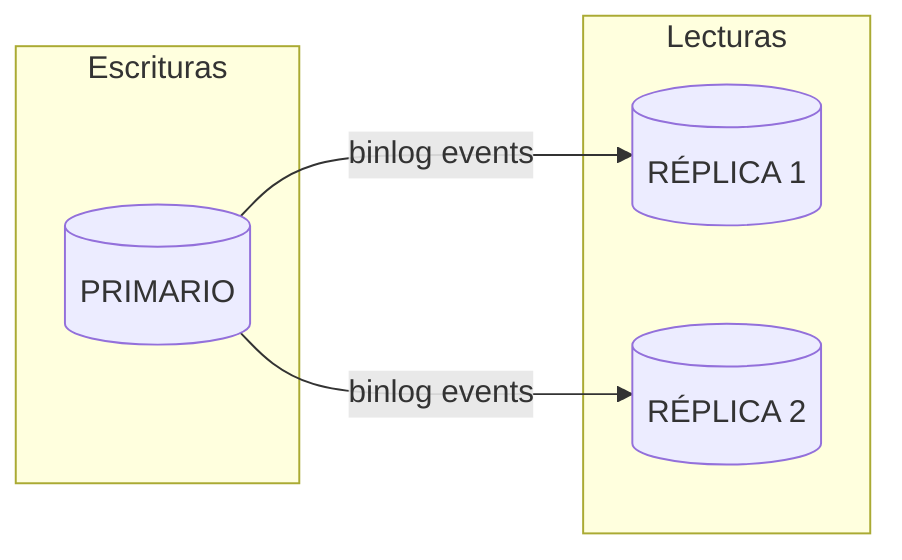
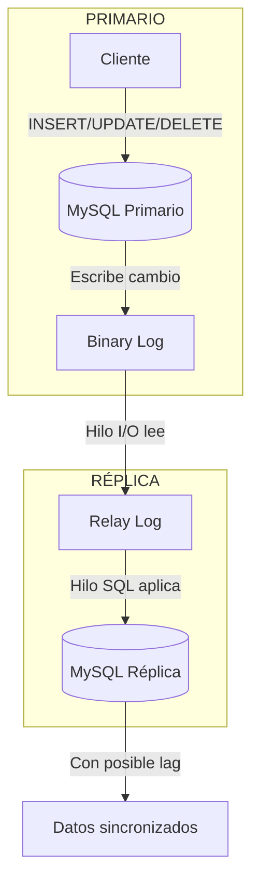

# Tema 2. Administración y Configuración del SGBD (sobre Docker)

## 1. Configuración del servicio (Docker Compose)

### 1.1. Compose mínimo recomendado

Archivo `compose.yaml` (ejemplo comentado, línea a línea):

```yaml
services:
  mysql: # nombre del servicio (lo usas en docker compose logs mysql)
    image: mysql:8.0 # versión de MySQL (mejor fijarla)
    container_name: mysql8 # nombre fijo del contenedor

    ports:
      - "3306:3306" # host:contenedor (tu máquina → contenedor)

    environment: # se aplica sobre TODO en el primer arranque (datos vacíos)
      MYSQL_ROOT_PASSWORD: "rootpass"
      MYSQL_DATABASE: "universidad"
      MYSQL_USER: "app"
      MYSQL_PASSWORD: "apppass"

    volumes:
      - mysql_data:/var/lib/mysql # persistencia (tablas/índices/datos)
      - ./mysql/conf.d:/etc/mysql/conf.d:ro # configuración extra (.cnf), solo lectura

    healthcheck: # indica cuándo MySQL está "listo"
      test:
        ["CMD", "mysqladmin", "ping", "-h", "127.0.0.1", "-uroot", "-prootpass"]
      interval: 10s
      timeout: 5s
      retries: 10

volumes:
  mysql_data: # define el volumen nombrado usado arriba
```

| Bloque                                | Por qué importa                                                                          |
| ------------------------------------- | ---------------------------------------------------------------------------------------- |
| `volumes: mysql_data:/var/lib/mysql`  | El volumen es la persistencia de la BD. Sin esto, al recrear el contenedor pierdes la BD |
| `ports`                               | Te permite conectar desde tu host con `mysql -h 127.0.0.1 -P 3306 ...`                   |
| `environment`                         | Crea credenciales/BD inicial SOLO la primera vez                                         |
| `./mysql/conf.d:/etc/mysql/conf.d:ro` | Te permite activar slow log/tuneo sin rebuild                                            |
| `healthcheck`                         | Evita que servicios dependientes fallen por arrancar "demasiado pronto"                  |

### 1.3. Configuración `[mysqld]` con archivo externo

Para añadir opciones de `[mysqld]`, crea un archivo `.cnf` en la carpeta `./mysql/conf.d/`. Docker monta esa carpeta dentro del contenedor y **MySQL lee automáticamente** todos los `*.cnf` al arrancar:

```
tu-proyecto/
├── compose.yaml
└── mysql/
    └── conf.d/
        └── custom.cnf      ← Aquí van tus opciones [mysqld]
```

**Archivo `./mysql/conf.d/custom.cnf`**:

```ini
[mysqld]
# Validación estricta de datos
sql_mode=STRICT_TRANS_TABLES,ERROR_FOR_DIVISION_BY_ZERO,NO_ENGINE_SUBSTITUTION

# Logs
log_error_verbosity=3
slow_query_log=1
long_query_time=0.5

# Rendimiento (ajustar según RAM disponible)
innodb_buffer_pool_size=256M
max_connections=200
```

> **Importante**: El volumen `./mysql/conf.d:/etc/mysql/conf.d:ro` monta la carpeta en modo solo lectura (`:ro`). MySQL lee automáticamente todos los archivos `*.cnf` de esa carpeta al arrancar. **Si modificas el `.cnf`, reinicia el contenedor** con `docker compose restart mysql`.

**Alternativa: opciones directamente en `command`** (para pocas opciones):

```yaml
services:
  mysql:
    image: mysql:8.0
    command:
      - "--sql-mode=STRICT_TRANS_TABLES,ERROR_FOR_DIVISION_BY_ZERO,NO_ENGINE_SUBSTITUTION"
      - "--slow-query-log=1"
      - "--long-query-time=0.5"
```

| Método               | Ventajas                       | Desventajas                          |
| -------------------- | ------------------------------ | ------------------------------------ |
| Archivo `.cnf`       | Organizado, fácil de versionar | Requiere crear carpeta/archivo       |
| `command` en compose | Rápido para pocas opciones     | Se vuelve difícil de leer con muchas |

### 1.2. Configuración del servidor

MySQL suele leer configuración desde:

- `/etc/mysql/my.cnf`
- `/etc/mysql/conf.d/*.cnf`
- `/etc/mysql/mysql.conf.d/*.cnf`

Tabla rápida: configuración común (valores típicos de producción)

| Opción (`[mysqld]`)              | Valor típico (producción)                                               | Para qué sirve                                                                                                                                        |
| -------------------------------- | ----------------------------------------------------------------------- | ----------------------------------------------------------------------------------------------------------------------------------------------------- |
| `sql_mode`                       | `STRICT_TRANS_TABLES,ERROR_FOR_DIVISION_BY_ZERO,NO_ENGINE_SUBSTITUTION` | Define el "modo" de validación SQL. Con `STRICT_*` MySQL rechaza datos inválidos en vez de truncar/ajustar silenciosamente (mejora consistencia).     |
| `slow_query_log`                 | `1`                                                                     | Activa el **slow query log**: registra consultas que superan `long_query_time` (base para optimización).                                              |
| `long_query_time`                | `0.5`–`2.0`                                                             | Umbral (segundos) para que una consulta se considere "lenta" y se loguee en el slow log.                                                              |
| `log_error_verbosity`            | `3`                                                                     | Nivel de detalle del **error log** (mensajes más verbosos → diagnóstico más fácil).                                                                   |
| `max_connections`                | `200`–`1000`                                                            | Máximo de conexiones simultáneas. Si se queda corto tendrás errores por saturación; si se sube sin control puede agotar RAM/threads.                  |
| `performance_schema`             | `1`                                                                     | Activa `performance_schema` para instrumentación (esperas, bloqueos, latencias). Útil para diagnóstico; con overhead moderado.                        |
| `innodb_buffer_pool_size`        | 60–75% de la RAM de la máquina                                          | Tamaño del **buffer pool** (caché de InnoDB para datos/índices). Si es pequeño aumenta I/O a disco; si es enorme puede presionar memoria del sistema. |
| `innodb_flush_log_at_trx_commit` | `1`                                                                     | Durabilidad del redo log: `1` fuerza flush por commit (máxima durabilidad). Valores menores aumentan rendimiento pero pierden durabilidad ante caída. |
| `sync_binlog`                    | `1` (si `log_bin=ON`)                                                   | Durabilidad del binlog: `1` sincroniza el binlog a disco en cada commit (recomendado si dependes de replicación/PITR).                                |
| `binlog_expire_logs_seconds`     | `604800` (7 días)                                                       | Tiempo de retención de binlogs. Evita llenar disco, pero debe alinearse con tu política de backups/PITR.                                              |

Ejemplo `./mysql/conf.d/server.cnf`:

```ini
[mysqld]
sql_mode=STRICT_TRANS_TABLES,ERROR_FOR_DIVISION_BY_ZERO,NO_ENGINE_SUBSTITUTION
log_error_verbosity=3
slow_query_log=1
long_query_time=0.5
```

## 2. Arranque, parada y acceso

### 2.1. Comandos Docker Compose (chuleta)

| Comando                        | Qué hace                                | ¿Borra datos?         |
| ------------------------------ | --------------------------------------- | --------------------- |
| `docker compose up -d`         | Crea/arranca servicios en segundo plano | No (si hay volumen)   |
| `docker compose ps`            | Estado de servicios                     | No                    |
| `docker compose logs -f mysql` | Ver logs del contenedor                 | No                    |
| `docker compose stop mysql`    | Parada "limpia"                         | No                    |
| `docker compose start mysql`   | Arranque de contenedor existente        | No                    |
| `docker compose down`          | Borra contenedores/red                  | No (volúmenes quedan) |
| `docker compose down -v`       | Borra también volúmenes                 | Sí                    |

### 2.2. Entrar al cliente MySQL

Dentro del contenedor:

```bash
docker exec -it mysql8 mysql -uroot -p
```

> - `-it` significa "interactivo": mantiene la conexión abierta y permite interactuar.
> - `mysql` es el cliente de MySQL.
> - `-uroot` es el usuario.
> - `-p` es la contraseña.
> - `-h 127.0.0.1` es el host.
> - `-P 3306` es el puerto.

Desde tu máquina:

```bash
mysql -h 127.0.0.1 -P 3306 -uroot -p
```

## 3. Administración básica del entorno de ejecución

### 3.1. Variables y configuración efectiva

| Acción                               | Comando                              |
| ------------------------------------ | ------------------------------------ |
| Ver versión                          | `SELECT VERSION();`                  |
| Ver variables                        | `SHOW VARIABLES;`                    |
| Ver estado                           | `SHOW STATUS;`                       |
| Filtrar                              | `SHOW VARIABLES LIKE 'innodb%';`     |
| Cambiar en caliente (si es dinámica) | `SET GLOBAL long_query_time = 0.2;`  |
| Persistir (si soporta PERSIST)       | `SET PERSIST long_query_time = 0.2;` |

> Si una variable no es dinámica/persistible, toca `.cnf` y reinicio.

### 3.2. Usuarios, roles y privilegios (operativo)

```sql
CREATE USER 'app'@'%' IDENTIFIED BY 'apppass';
GRANT SELECT, INSERT, UPDATE, DELETE ON universidad.* TO 'app'@'%';
SHOW GRANTS FOR 'app'@'%';
```

Buenas prácticas rápidas:

- Evitar `root` para aplicaciones.
- Limitar host (no siempre `'%'`).
- Principio de **mínimos privilegios**.

### 3.4. Procesos, conexiones y "qué está pasando ahora"

```sql
SHOW PROCESSLIST;
```

Si `performance_schema` está habilitado:

```sql
SELECT * FROM performance_schema.threads LIMIT 10;
```

### 3.5. Operación diaria

| Qué comprobar      | Comando                                  | Para qué sirve                                              |
| ------------------ | ---------------------------------------- | ----------------------------------------------------------- |
| Uptime             | `SHOW STATUS LIKE 'Uptime';`             | Para saber cuánto tiempo lleva el servidor funcionando      |
| Conexiones activas | `SHOW STATUS LIKE 'Threads_connected';`  | Para saber cuántas conexiones están activas                 |
| Total conexiones   | `SHOW STATUS LIKE 'Connections';`        | Para saber cuántas conexiones se han hecho en total         |
| Límite conexiones  | `SHOW VARIABLES LIKE 'max_connections';` | Para saber cuál es el límite de conexiones                  |
| Slow log           | `SHOW VARIABLES LIKE 'slow_query_log%';` | Para capturar las consultas lentas                          |
| Umbral lentas      | `SHOW VARIABLES LIKE 'long_query_time';` | Para saber desde qué tiempo se considera una consulta lenta |
| Stats optimizador  | `ANALYZE TABLE universidad.alumno;`      | Para mejorar la estimación tras carga                       |

## 4. Archivos, almacenamiento y logs

### 4.1. Dónde guarda MySQL los datos (estructura física)

```
/var/lib/mysql/                    ← Directorio de datos (en Docker: dentro del volumen)
├── ibdata1                        ← Tablespace compartido (metadatos, undo logs)
├── ib_logfile0, ib_logfile1       ← Redo logs (recuperación ante crash)
├── universidad/                   ← Carpeta por cada base de datos
│   ├── alumno.ibd                 ← Datos + índices de la tabla alumno
│   ├── profesor.ibd               ← Datos + índices de la tabla profesor
│   └── ...
└── mysql/                         ← BD del sistema (usuarios, privilegios...)
```

**Concepto clave: Tablespace**

Un tablespace es el archivo físico donde InnoDB almacena los datos de las tablas.

| Modo                         | Archivo                  | Ventaja                                    |
| ---------------------------- | ------------------------ | ------------------------------------------ |
| Compartido (por defecto)     | `ibdata1`                | Simple, todo junto                         |
| Por tabla (`file_per_table`) | `tabla.ibd` por cada una | Puedes borrar/mover tablas individualmente |

> En MySQL 8+ `innodb_file_per_table=ON` viene activado por defecto (recomendado).

### 4.2. Archivos de registro (logs): qué son y para qué sirven

MySQL mantiene varios logs con propósitos distintos:

```
┌─────────────────┐     ┌─────────────────┐     ┌─────────────────┐
│   Error Log     │     │  Slow Query Log │     │     Binlog      │
│  (diagnóstico)  │     │  (optimización) │     │  (replicación)  │
└─────────────────┘     └─────────────────┘     └─────────────────┘
        ↓                       ↓                       ↓
  "MySQL no arranca"    "Esta query tarda 5s"   "Replicar a otra BD"
```

| Log                | Qué registra                             | Cuándo lo consultas                               | Ubicación típica           |
| ------------------ | ---------------------------------------- | ------------------------------------------------- | -------------------------- |
| **Error log**      | Errores de arranque, crashes, avisos     | Cuando algo falla o MySQL no inicia               | `/var/log/mysql/error.log` |
| **Slow query log** | Consultas que superan `long_query_time`  | Para encontrar queries lentas a optimizar         | `/var/log/mysql/slow.log`  |
| **Binary log**     | Todos los cambios (INSERT/UPDATE/DELETE) | Replicación y recuperación punto-en-tiempo (PITR) | `mysql-bin.000001`, etc.   |
| **Redo log**       | Cambios pendientes de escribir a disco   | Interno de InnoDB (recuperación crash)            | `ib_logfile0/1`            |
| **Undo log**       | Estado anterior para rollback/MVCC       | Interno de InnoDB (transacciones)                 | Dentro de `ibdata1`        |

**Ejemplo práctico**: si una query tarda mucho, aparecerá en el slow log:

```sql
-- Ver si está activado
SHOW VARIABLES LIKE 'slow_query_log%';

-- Ver el umbral (en segundos)
SHOW VARIABLES LIKE 'long_query_time';
```

### 4.3. Mantenimiento del almacenamiento

| Tarea                     | Qué hacer                               | Por qué importa                                    |
| ------------------------- | --------------------------------------- | -------------------------------------------------- |
| **Vigilar espacio**       | Monitorizar tamaño de `.ibd` y binlogs  | Evitar que el disco se llene                       |
| **Rotar binlogs**         | Configurar `binlog_expire_logs_seconds` | Los binlogs crecen indefinidamente                 |
| **Optimizar tablas**      | `OPTIMIZE TABLE` tras muchos DELETE     | Recupera espacio fragmentado (usar con moderación) |
| **Analizar estadísticas** | `ANALYZE TABLE` tras cargas masivas     | Mejora las decisiones del optimizador              |

```sql
-- Ver tamaño de tablas en MB
SELECT
    table_name,
    ROUND(data_length / 1024 / 1024, 2) AS datos_MB,
    ROUND(index_length / 1024 / 1024, 2) AS indices_MB
FROM information_schema.tables
WHERE table_schema = 'universidad';
```

### 4.4. Organización lógica (buenas prácticas)

| Aspecto      | Recomendación                                            | Ejemplo                           |
| ------------ | -------------------------------------------------------- | --------------------------------- |
| **Esquemas** | Un schema por dominio funcional                          | `universidad`, `rrhh`, `finanzas` |
| **Nombres**  | Convención consistente (snake_case, singular)            | `alumno`, `profesor`, `matricula` |
| **Índices**  | Prefijo descriptivo                                      | `idx_alumno_email`, `uk_dni`      |
| **Vistas**   | Para simplificar consultas complejas o restringir acceso | `v_alumnos_activos`               |

### 4.5. Modificar opciones de la base de datos

```sql
ALTER DATABASE universidad
  CHARACTER SET utf8mb4
  COLLATE utf8mb4_0900_ai_ci;
```

| Cambio                   | Impacto                                                       |
| ------------------------ | ------------------------------------------------------------- |
| **Character set**        | Afecta cómo se almacenan los caracteres (utf8mb4 = emojis OK) |
| **Collation**            | Afecta comparaciones y ordenación (`ci` = case insensitive)   |
| **En tablas existentes** | Puede requerir `ALTER TABLE ... CONVERT TO` (costoso)         |

> **Tip**: `utf8mb4_0900_ai_ci` es el collation recomendado en MySQL 8+ (ai = accent insensitive, ci = case insensitive).

## 5. Replicación y alta disponibilidad

### 5.1. Qué es y para qué sirve

La replicación consiste en mantener copias sincronizadas de los datos en múltiples servidores MySQL.



| Beneficio               | Descripción                                              | Ejemplo de uso                        |
| ----------------------- | -------------------------------------------------------- | ------------------------------------- |
| **Escalar lecturas**    | Las réplicas atienden SELECT, el primario solo escritura | App con 90% lecturas / 10% escrituras |
| **Alta disponibilidad** | Si cae el primario, una réplica puede tomar su lugar     | Failover ante fallo de hardware       |
| **Aislar cargas**       | Ejecutar reportes pesados sin afectar producción         | BI/Analytics en réplica dedicada      |
| **Backups sin impacto** | Hacer backup de una réplica, no del primario             | Backup nocturno sin bloquear tablas   |

### 5.2. Tipos de replicación

```
ASÍNCRONA (por defecto)              SEMISÍNCRONA
─────────────────────────            ─────────────────────────
Primario ──▶ Réplica                 Primario ──▶ Réplica
   │                                    │            │
   └─ COMMIT inmediato                  └─ espera ◀──┘ ACK
                                           COMMIT

✓ Más rápido                         ✓ Más seguro
✗ Puede perder datos si              ✗ Más lento (espera red)
  el primario cae antes
  de replicar
```

| Tipo             | Cómo funciona                                    | Cuándo usarla                          |
| ---------------- | ------------------------------------------------ | -------------------------------------- |
| **Asíncrona**    | El primario no espera confirmación de la réplica | Mayoría de casos, prioriza rendimiento |
| **Semisíncrona** | El commit espera ACK de al menos 1 réplica       | Cuando no puedes perder transacciones  |

**¿Cómo se configura cada tipo?**

- **Asíncrona**: Es el **comportamiento por defecto**. No hay que hacer nada especial.
- **Semisíncrona**: Requiere **activar plugins** en primario y réplica.

```sql
-- EN EL PRIMARIO: instalar y activar plugin semisíncrono
INSTALL PLUGIN rpl_semi_sync_source SONAME 'semisync_source.so';
SET GLOBAL rpl_semi_sync_source_enabled = ON;

-- Configurar timeout (ms) - si la réplica no responde, vuelve a asíncrono
SET GLOBAL rpl_semi_sync_source_timeout = 10000;  -- 10 segundos

-- EN LA RÉPLICA: instalar y activar plugin
INSTALL PLUGIN rpl_semi_sync_replica SONAME 'semisync_replica.so';
SET GLOBAL rpl_semi_sync_replica_enabled = ON;

-- Reiniciar replicación para que tome efecto
STOP REPLICA;
START REPLICA;
```

**Verificar que está activo**:

```sql
-- En el primario
SHOW STATUS LIKE 'Rpl_semi_sync_source_status';  -- Debe ser ON

-- En la réplica
SHOW STATUS LIKE 'Rpl_semi_sync_replica_status';  -- Debe ser ON
```

**Para hacerlo persistente** (en `my.cnf`):

```ini
# En el primario
[mysqld]
plugin_load_add = semisync_source.so
rpl_semi_sync_source_enabled = ON
rpl_semi_sync_source_timeout = 10000

# En la réplica
[mysqld]
plugin_load_add = semisync_replica.so
rpl_semi_sync_replica_enabled = ON
```

> **Nota**: Si la réplica no responde en el tiempo de `timeout`, MySQL vuelve automáticamente a modo asíncrono para no bloquear el primario.

### 5.3. Cómo funciona internamente



### 5.4. Configuración necesaria

**En el primario** (`my.cnf`):

```ini
[mysqld]
server_id = 1                      # Único para cada servidor
log_bin = mysql-bin                # Activa binary log
binlog_format = ROW                # Formato recomendado (más seguro)
binlog_expire_logs_seconds = 604800  # Retención: 7 días
```

**En la réplica** (`my.cnf`):

```ini
[mysqld]
server_id = 2                      # Diferente al primario
relay_log = relay-bin              # Nombre del relay log
read_only = ON                     # Evita escrituras accidentales
```

**Configurar la réplica para conectar al primario**:

```sql
CHANGE REPLICATION SOURCE TO
  SOURCE_HOST = '192.168.1.10',
  SOURCE_USER = 'repl_user',
  SOURCE_PASSWORD = 'repl_pass',
  SOURCE_LOG_FILE = 'mysql-bin.000001',
  SOURCE_LOG_POS = 154;

START REPLICA;
```

### 5.4. Monitorización

**En el primario** - ver estado del binlog:

```sql
SHOW MASTER STATUS;
-- File: mysql-bin.000003
-- Position: 12345
```

**En la réplica** - ver estado de la replicación:

```sql
SHOW REPLICA STATUS\G
```

| Campo clave             | Qué significa                | Valor esperado |
| ----------------------- | ---------------------------- | -------------- |
| `Replica_IO_Running`    | ¿Está leyendo del primario?  | `Yes`          |
| `Replica_SQL_Running`   | ¿Está aplicando los cambios? | `Yes`          |
| `Seconds_Behind_Source` | Segundos de retraso (lag)    | `0` (ideal)    |
| `Last_Error`            | Último error de replicación  | (vacío)        |

### 5.5. Problemas comunes y soluciones

| Problema               | Síntoma                            | Solución                                     |
| ---------------------- | ---------------------------------- | -------------------------------------------- |
| **Lag alto**           | `Seconds_Behind_Source` crece      | Optimizar queries, más CPU en réplica        |
| **Replicación parada** | `Replica_SQL_Running = No`         | Ver `Last_Error`, corregir y `START REPLICA` |
| **Split-brain**        | Dos primarios aceptando escrituras | Apagar uno inmediatamente, reconciliar datos |
| **Binlog lleno**       | Disco lleno en primario            | Ajustar `binlog_expire_logs_seconds`         |

### 5.6. Failover: qué hacer si cae el primario

```
ANTES                              DESPUÉS (failover)
──────                             ──────────────────
┌──────────┐                       ┌──────────┐
│ Primario │ ✗ CAÍDO               │ Réplica 1│ ← NUEVO PRIMARIO
└──────────┘                       └──────────┘
     │                                  │
     ▼                                  ▼
┌──────────┐                       ┌──────────┐
│ Réplica 1│                       │ Réplica 2│ ← Apunta al nuevo
└──────────┘                       └──────────┘
```

**Failover manual** (pasos básicos):

1. Verificar que la réplica está al día (`Seconds_Behind_Source = 0`)
2. Promover réplica: `STOP REPLICA; RESET REPLICA ALL;`
3. Quitar `read_only`: `SET GLOBAL read_only = OFF;`
4. Redirigir aplicaciones al nuevo primario
5. Reconfigurar otras réplicas para apuntar al nuevo primario

> **Failover automático** requiere herramientas externas como MySQL Router, Orchestrator o ProxySQL. No viene "gratis" con MySQL.
