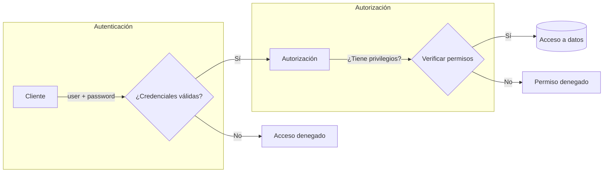
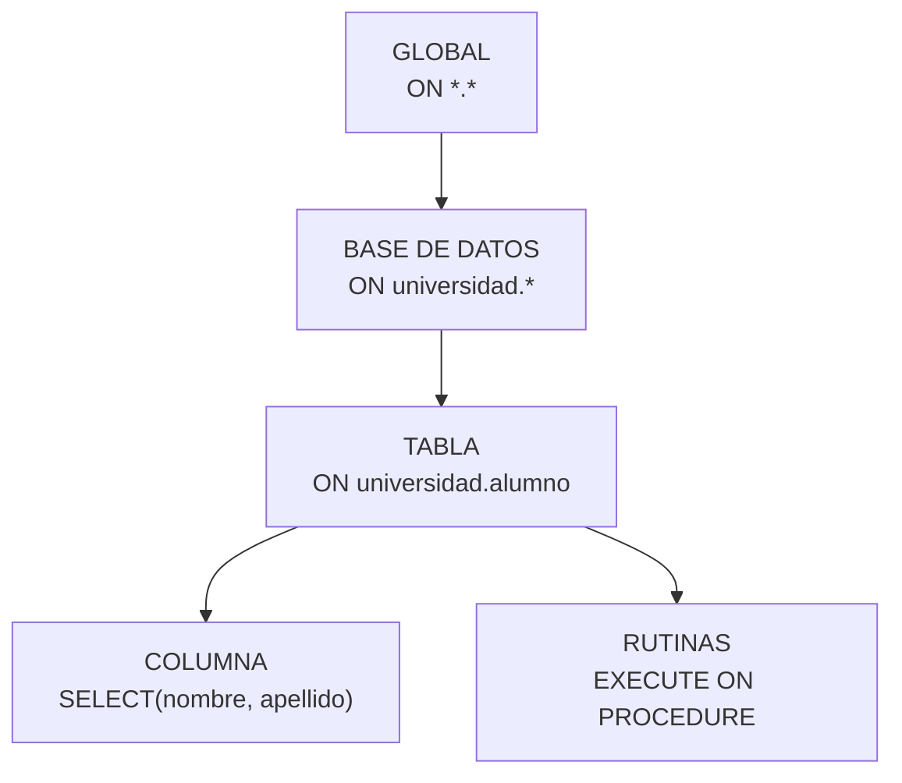
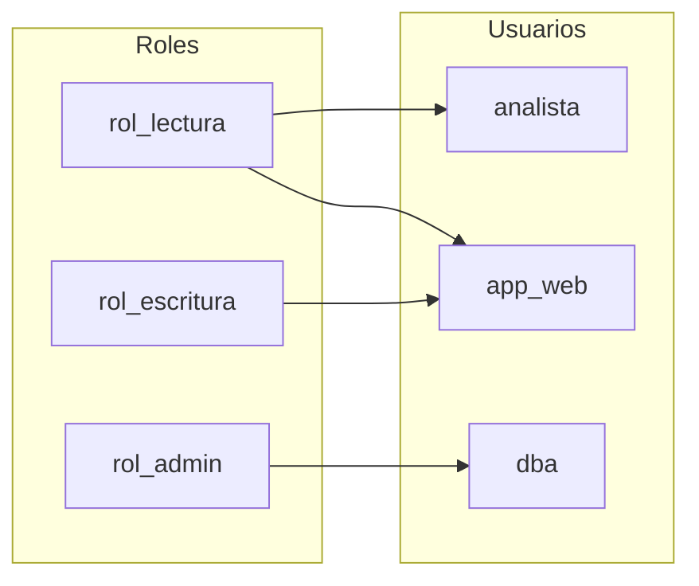

# Tema 3. Seguridad y Control de Accesos (MySQL 8)

## 1. Autenticación vs autorización

| Concepto          | Pregunta que responde | Ejemplo                                    |
| ----------------- | --------------------- | ------------------------------------------ |
| **Autenticación** | ¿Quién eres?          | Usuario `app` con contraseña `secreto123`  |
| **Autorización**  | ¿Qué puedes hacer?    | Puede hacer SELECT en `universidad.alumno` |



## 2. Cuentas en MySQL: el concepto `'user'@'host'`

En MySQL, una cuenta NO es solo un nombre de usuario. Es la combinación de **usuario + origen de conexión**.

```
'app'@'localhost'     ← Solo puede conectar desde el mismo servidor
'app'@'192.168.1.%'   ← Solo puede conectar desde esa subred
'app'@'%'             ← Puede conectar desde cualquier lugar (PELIGRO!)
```

> **Importante**: `'app'@'localhost'` y `'app'@'%'` son cuentas DIFERENTES, con contraseñas y permisos independientes.

### 2.1. Ver las cuentas existentes

```sql
-- Ver todas las cuentas
SELECT user, host, plugin, account_locked, password_expired
FROM mysql.user
ORDER BY user, host;
```

| Columna            | Qué significa                          |
| ------------------ | -------------------------------------- |
| `user`             | Nombre de usuario                      |
| `host`             | Desde dónde puede conectar             |
| `plugin`           | Método de autenticación                |
| `account_locked`   | Si la cuenta está bloqueada (`Y`/`N`)  |
| `password_expired` | Si la contraseña ha expirado (`Y`/`N`) |

## 3. Autenticación: plugins y contraseñas

### 3.1. Plugins de autenticación

MySQL usa `plugins` para verificar contraseñas. Los más comunes:

| Plugin                  | Descripción                        | Cuándo usarlo                      |
| ----------------------- | ---------------------------------- | ---------------------------------- |
| `caching_sha2_password` | Por defecto en MySQL 8, más seguro | Siempre que sea posible            |
| `mysql_native_password` | Método antiguo, menos seguro       | Compatibilidad con clientes viejos |

```sql
-- Ver qué plugin usa cada cuenta
SELECT user, host, plugin
FROM mysql.user
WHERE user IN ('root', 'app');

-- Cambiar contraseña y plugin
ALTER USER 'app'@'%'
  IDENTIFIED WITH caching_sha2_password
  BY 'ContraseñaMuySegura123!';
```

### 3.2. Cifrado en tránsito (TLS/SSL)

TLS protege los datos mientras viajan entre cliente y servidor (evita que alguien "escuche" la conexión).

```sql
-- Ver si la conexión actual usa TLS
SHOW STATUS LIKE 'Ssl_cipher';
-- Si devuelve un valor (ej: TLS_AES_256_GCM_SHA384), está cifrado
-- Si está vacío, la conexión NO está cifrada
```

Para forzar TLS en el servidor:

```ini
# En my.cnf
[mysqld]
require_secure_transport = ON
```

### 3.3. Políticas de contraseñas

MySQL puede validar que las contraseñas cumplan requisitos mínimos:

```sql
-- Ver configuración actual
SHOW VARIABLES LIKE 'authentication_policy%';
```

Si no devuelve nada, es que no está el plugin instalado. Para instalarlo:

```sql
-- Instalar el plugin
INSTALL PLUGIN validate_password SONAME 'validate_password.so';

-- Ver plugins instalados
SHOW PLUGINS;
```

| Variable                             | Qué controla                     | Valor típico |
| ------------------------------------ | -------------------------------- | ------------ |
| `validate_password.length`           | Longitud mínima                  | 8            |
| `validate_password.policy`           | Nivel de exigencia               | MEDIUM       |
| `validate_password.mixed_case_count` | Mayúsculas/minúsculas requeridas | 1            |

## 4. Gestión de cuentas (CRUD de usuarios)

### 4.1. Operaciones básicas

```sql
-- CREAR cuenta
CREATE USER 'app'@'%' IDENTIFIED BY 'MiContraseña123!';

-- CREAR cuenta que solo puede conectar desde localhost
CREATE USER 'admin_local'@'localhost' IDENTIFIED BY 'OtraContraseña!';

-- MODIFICAR contraseña
ALTER USER 'app'@'%' IDENTIFIED BY 'NuevaContraseña456!';

-- BLOQUEAR cuenta (sin borrarla)
ALTER USER 'app'@'%' ACCOUNT LOCK;

-- DESBLOQUEAR cuenta
ALTER USER 'app'@'%' ACCOUNT UNLOCK;

-- FORZAR cambio de contraseña en próximo login
ALTER USER 'app'@'%' PASSWORD EXPIRE;

-- ELIMINAR cuenta
DROP USER 'app'@'%';
```

### 4.2. Resumen de operaciones

| Operación          | Comando SQL                             | Efecto                              |
| ------------------ | --------------------------------------- | ----------------------------------- |
| Crear cuenta       | `CREATE USER 'u'@'h' IDENTIFIED BY ...` | Nueva cuenta con contraseña         |
| Cambiar contraseña | `ALTER USER 'u'@'h' IDENTIFIED BY ...`  | Actualiza credenciales              |
| Bloquear           | `ALTER USER 'u'@'h' ACCOUNT LOCK`       | Impide login (cuenta existe)        |
| Desbloquear        | `ALTER USER 'u'@'h' ACCOUNT UNLOCK`     | Permite login de nuevo              |
| Expirar contraseña | `ALTER USER 'u'@'h' PASSWORD EXPIRE`    | Obliga a cambiarla en próximo login |
| Eliminar           | `DROP USER 'u'@'h'`                     | Borra cuenta y todos sus permisos   |

## 5. Autorización: privilegios y permisos

### 5.1. Niveles de permisos (de más amplio a más específico)



| Nivel      | Sintaxis                      | Ejemplo de uso                     |
| ---------- | ----------------------------- | ---------------------------------- |
| Global     | `ON *.*`                      | Administradores del servidor       |
| Base datos | `ON universidad.*`            | App que trabaja con una BD         |
| Tabla      | `ON universidad.alumno`       | Acceso restringido a una tabla     |
| Columna    | `SELECT(col1, col2) ON tabla` | Ocultar columnas sensibles         |
| Rutina     | `EXECUTE ON PROCEDURE proc`   | Permitir ejecutar un procedimiento |

### 5.2. Privilegios más comunes

**Para aplicaciones (datos)**:

| Privilegio | Permite                    | Riesgo   |
| ---------- | -------------------------- | -------- |
| `SELECT`   | Leer datos                 | 🟢 Bajo  |
| `INSERT`   | Insertar filas             | 🟡 Medio |
| `UPDATE`   | Modificar filas existentes | 🟡 Medio |
| `DELETE`   | Borrar filas               | 🟠 Alto  |

**Para desarrollo (estructura)**:

| Privilegio | Permite                        | Riesgo      |
| ---------- | ------------------------------ | ----------- |
| `INDEX`    | Crear/eliminar índices         | 🟡 Medio    |
| `CREATE`   | Crear tablas/índices           | 🟡 Medio    |
| `ALTER`    | Modificar estructura de tablas | 🟠 Alto     |
| `DROP`     | Eliminar tablas/bases de datos | 🔴 Muy alto |

**Para administración (sistema)**:

| Privilegio     | Permite                 | Riesgo      |
| -------------- | ----------------------- | ----------- |
| `PROCESS`      | Ver todos los procesos  | 🟠 Alto     |
| `RELOAD`       | Ejecutar FLUSH          | 🟠 Alto     |
| `CREATE USER`  | Crear/modificar cuentas | 🔴 Muy alto |
| `GRANT OPTION` | Dar permisos a otros    | 🔴 Muy alto |
| `SHUTDOWN`     | Apagar el servidor      | ⛔ Crítico  |

```sql
-- Ver todos los privilegios disponibles
SHOW PRIVILEGES;
```

### 5.3. GRANT y REVOKE: dar y quitar permisos

**Sintaxis general**:

```sql
-- DAR permisos
GRANT <privilegios> ON <base_datos>.<tabla> TO '<usuario>'@'<host>';

-- QUITAR permisos
REVOKE <privilegios> ON <base_datos>.<tabla> FROM '<usuario>'@'<host>';

-- Ver permisos de una cuenta
SHOW GRANTS FOR '<usuario>'@'<host>';
```

| Elemento        | Descripción                          | Ejemplos                                     |
| --------------- | ------------------------------------ | -------------------------------------------- |
| `<privilegios>` | Lista de permisos separados por coma | `SELECT`, `INSERT, UPDATE`, `ALL PRIVILEGES` |
| `<base_datos>`  | Nombre de la BD o `*` para todas     | `tienda`, `universidad`, `*`                 |
| `<tabla>`       | Nombre de tabla o `*` para todas     | `clientes`, `productos`, `*`                 |
| `<usuario>`     | Nombre del usuario                   | `app`, `admin`, `reportes`                   |
| `<host>`        | Host permitido                       | `localhost`, `%`, `192.168.1.%`              |

**Ejemplos prácticos**:

```sql
-- Permisos de lectura en toda una BD
GRANT SELECT ON universidad.* TO 'app'@'%';

-- Permisos CRUD en una tabla específica
GRANT SELECT, INSERT, UPDATE, DELETE ON tienda.clientes TO 'app'@'localhost';

-- Todos los permisos en una BD
GRANT ALL PRIVILEGES ON tienda.* TO 'admin'@'localhost';

-- Quitar un permiso específico
REVOKE DELETE ON universidad.* FROM 'app'@'%';
```

**Ejemplo completo para una aplicación típica**:

```sql
-- 1. Crear la cuenta
CREATE USER 'mi_app'@'%' IDENTIFIED BY 'ContraseñaSegura!';

-- 2. Dar permisos de lectura/escritura en una BD
GRANT SELECT, INSERT, UPDATE, DELETE ON tienda.* TO 'mi_app'@'%';

-- 3. Verificar
SHOW GRANTS FOR 'mi_app'@'%';
-- Resultado:
-- GRANT SELECT, INSERT, UPDATE, DELETE ON `tienda`.* TO `mi_app`@`%`
```

### 5.4. Roles: agrupar permisos (MySQL 8+)

Los roles permiten definir "perfiles" de permisos y asignarlos a múltiples usuarios.



```sql
-- 1. Crear roles
CREATE ROLE 'rol_lectura', 'rol_escritura';

-- 2. Asignar privilegios a los roles
GRANT SELECT ON universidad.* TO 'rol_lectura';
GRANT INSERT, UPDATE, DELETE ON universidad.* TO 'rol_escritura';

-- 3. Asignar roles a usuarios
GRANT 'rol_lectura' TO 'analista'@'localhost';
GRANT 'rol_lectura', 'rol_escritura' TO 'app'@'%';

-- 4. Activar rol por defecto (importante!)
SET DEFAULT ROLE 'rol_lectura' TO 'analista'@'localhost';
SET DEFAULT ROLE ALL TO 'app'@'%';

-- 5. Verificar
SHOW GRANTS FOR 'analista'@'localhost';
```

> **Nota**: Sin `SET DEFAULT ROLE`, el usuario debe activar el rol manualmente con `SET ROLE 'nombre_rol'` en cada sesión.

## 6. Control de acceso con vistas

Las vistas permiten exponer solo ciertas columnas o filas, ocultando datos sensibles.

### 6.1. Patrón: ocultar columnas sensibles

```sql
-- Tabla original con datos sensibles
-- alumno(id, dni, nombre, apellido, email, telefono, direccion)

-- Vista "pública" sin datos sensibles
CREATE VIEW v_alumno_publico AS
SELECT id_alumno, nombre, apellido1, apellido2
FROM alumno;

-- Dar acceso SOLO a la vista
GRANT SELECT ON universidad.v_alumno_publico TO 'analista'@'localhost';
-- El analista NO puede ver email, telefono, direccion
```

### 6.2. Patrón: filtrar filas

```sql
-- Vista que solo muestra alumnos activos
CREATE VIEW v_alumnos_activos AS
SELECT * FROM alumno
WHERE estado = 'activo';

-- El usuario solo ve alumnos activos, no los dados de baja
GRANT SELECT ON universidad.v_alumnos_activos TO 'consultas'@'%';
```

## 7. Auditoría y supervisión

### 7.1. Revisar cuentas y permisos

```sql
-- Ver todas las cuentas y su estado
SELECT user, host, account_locked, password_expired, plugin
FROM mysql.user
ORDER BY user, host;

-- Ver permisos de una cuenta específica
SHOW GRANTS FOR 'app'@'%';

-- Ver permisos desde information_schema (más detalle)
SELECT * FROM information_schema.user_privileges
WHERE grantee = "'app'@'%'";

-- Ver permisos a nivel de BD
SELECT * FROM information_schema.schema_privileges
WHERE grantee = "'app'@'%'";
```

### 7.2. Detectar configuraciones inseguras

```sql
-- Cuentas que pueden conectar desde cualquier lugar
SELECT user, host FROM mysql.user WHERE host = '%';

-- Cuentas con GRANT OPTION (pueden dar permisos a otros)
SELECT grantee, privilege_type
FROM information_schema.user_privileges
WHERE privilege_type = 'GRANT OPTION';

-- Cuentas con permisos globales (ON *.*)
SELECT grantee, privilege_type
FROM information_schema.user_privileges
WHERE table_catalog = 'def';
```

### 7.3. Logs útiles para seguridad

| Log               | Qué registra                  | Cómo verlo                      |
| ----------------- | ----------------------------- | ------------------------------- |
| Error log         | Intentos de conexión fallidos | `docker compose logs mysql`     |
| General query log | TODAS las queries (¡cuidado!) | Activar con `general_log=ON`    |
| Slow query log    | Queries lentas                | Activar con `slow_query_log=ON` |

> **Nota**: El general query log genera MUCHO volumen. Solo activar para debugging puntual.

## 8. Errores comunes y buenas prácticas

### 8.1. Errores típicos (qué NO hacer)

| Error                           | Por qué es malo                         | Alternativa                         |
| ------------------------------- | --------------------------------------- | ----------------------------------- |
| `GRANT ALL ON *.* TO 'app'@'%'` | Da acceso total desde cualquier lugar   | Permisos específicos en BD concreta |
| Usar `root` para la aplicación  | Si comprometen la app, pierdes todo     | Crear cuenta específica con mínimos |
| `'user'@'%'` sin necesidad      | Expone la cuenta a toda la red          | Restringir a `localhost` o subred   |
| No revocar permisos antiguos    | Acumulación de privilegios innecesarios | Auditar y limpiar periódicamente    |
| Contraseñas en código fuente    | Cualquiera con acceso al repo las ve    | Variables de entorno o secrets      |

### 8.2. Buenas prácticas (qué SÍ hacer)

`Dar solo los permisos estrictamente necesarios, ni uno más, ni uno menos`

| Práctica                        | Implementación                                       |
| ------------------------------- | ---------------------------------------------------- |
| **Mínimo privilegio**           | Empezar con `SELECT`, añadir solo lo necesario       |
| **Separar cuentas por función** | Una para la app, otra para backups, otra para admin  |
| **Restringir origen**           | `'app'@'192.168.1.%'` mejor que `'app'@'%'`          |
| **Usar roles**                  | Facilita gestión y auditoría                         |
| **Rotar contraseñas**           | Especialmente tras incidentes o rotación de personal |
| **Auditar periódicamente**      | Revisar cuentas y permisos cada X tiempo             |

### 8.3. Ejemplo de configuración segura para una aplicación

```sql
-- 1. Crear cuenta restringida a la subred de la app
CREATE USER 'mi_app'@'10.0.1.%'
  IDENTIFIED WITH caching_sha2_password
  BY 'ContraseñaLargaYCompleja!2024';

-- 2. Dar solo los permisos necesarios
GRANT SELECT, INSERT, UPDATE ON produccion.* TO 'mi_app'@'10.0.1.%';
-- Nota: sin DELETE (la app usa soft-delete)
-- Nota: sin DDL (CREATE, ALTER, DROP)

-- 3. Verificar
SHOW GRANTS FOR 'mi_app'@'10.0.1.%';

-- 4. Para el equipo de BI (solo lectura)
CREATE USER 'bi_reports'@'10.0.2.%' IDENTIFIED BY 'OtraContraseña!';
GRANT SELECT ON produccion.* TO 'bi_reports'@'10.0.2.%';
```
