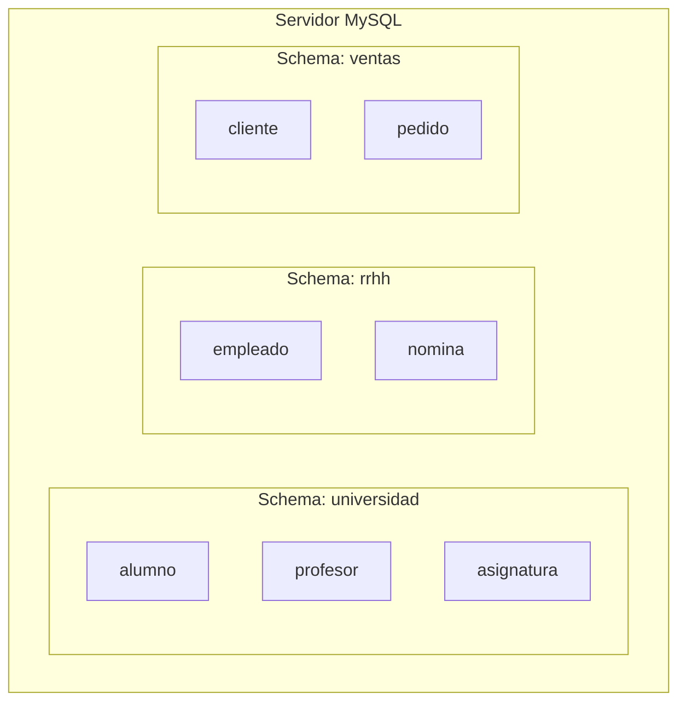
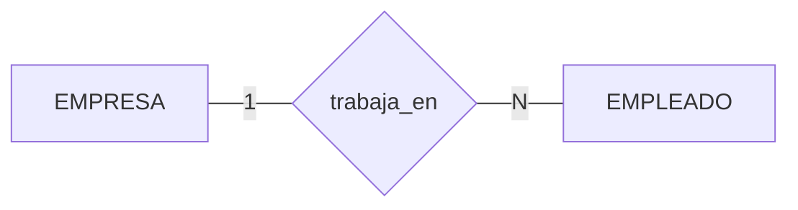
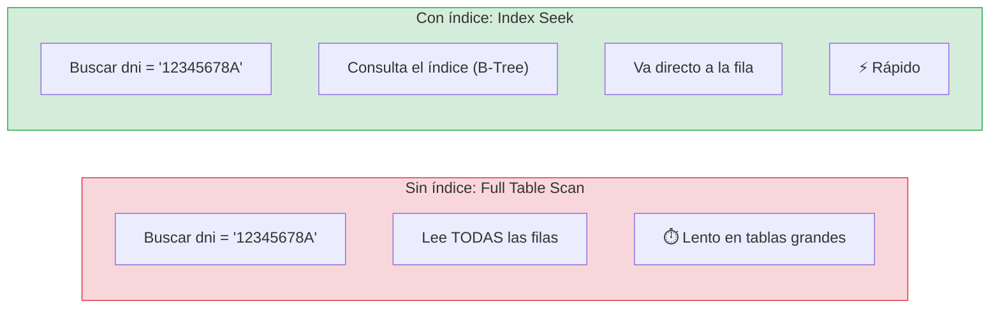
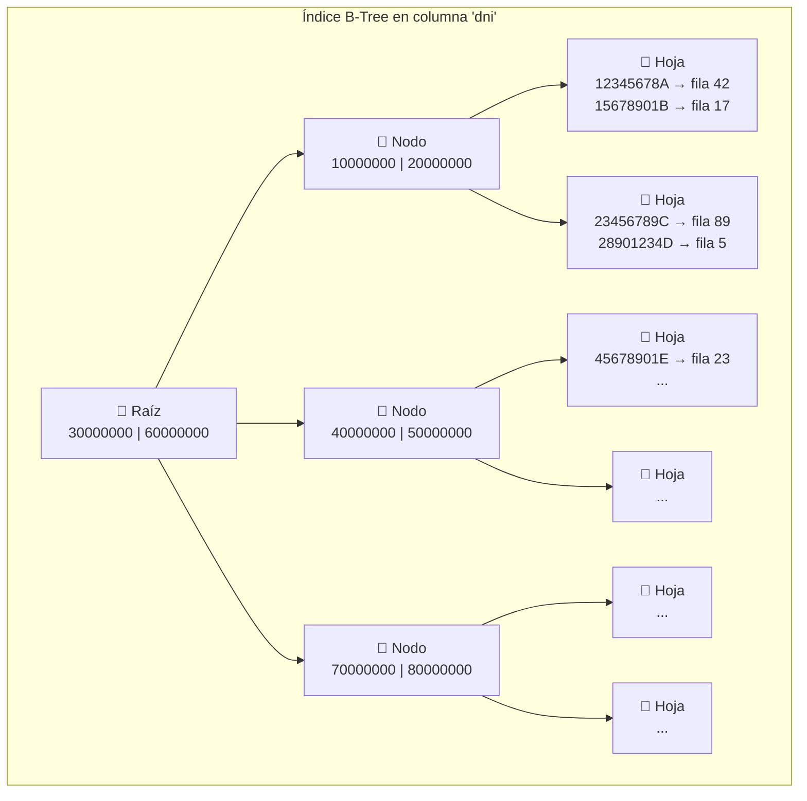
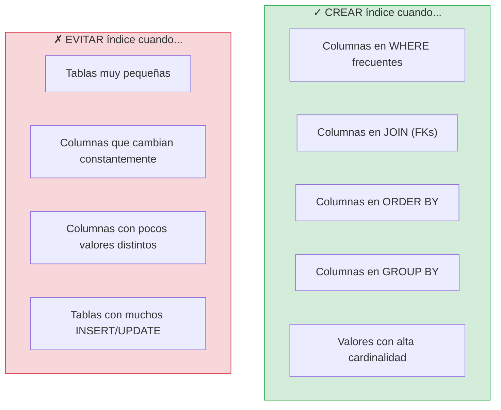
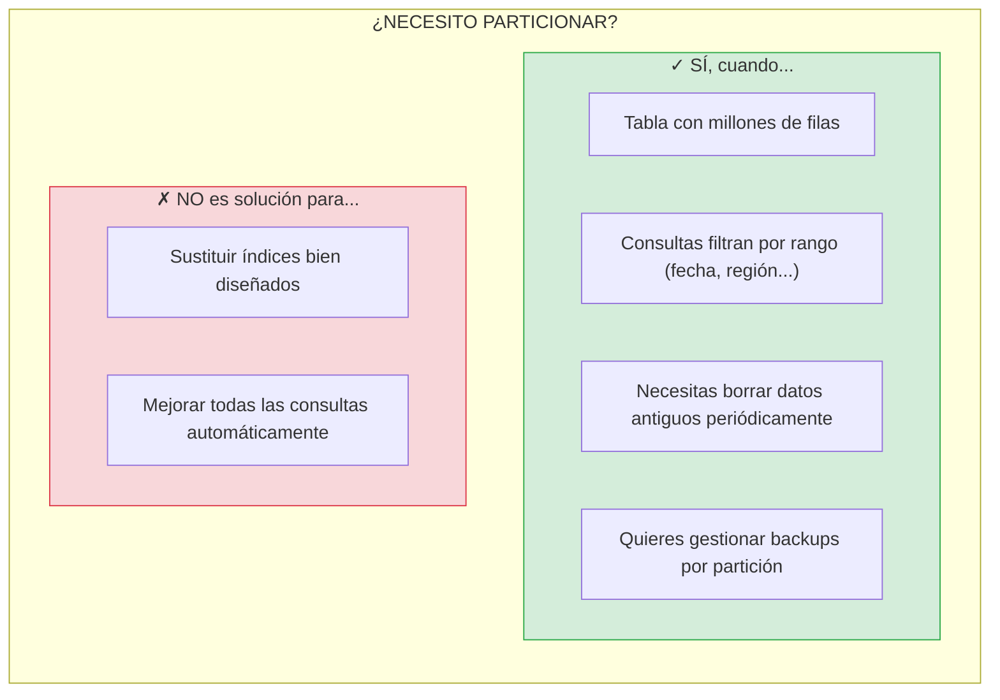

# Tema 4. Diseño Lógico y Objetos de Base de Datos

## 1. Esquemas: organización lógica de la base de datos

En MySQL, **`SCHEMA` = `DATABASE`** (son sinónimos). Un esquema agrupa y aísla objetos relacionados.



¿Para qué usar múltiples esquemas?

| Uso                     | Ejemplo                           | Beneficio                           |
| ----------------------- | --------------------------------- | ----------------------------------- |
| **Separar dominios**    | `universidad`, `rrhh`, `ventas`   | Cada área tiene sus tablas aisladas |
| **Separar entornos**    | `app_dev`, `app_test`, `app_prod` | Desarrollo no afecta a producción   |
| **Control de permisos** | `GRANT SELECT ON ventas.* TO ...` | Acceso granular por dominio         |

### 1.1 Ejemplo: crear y usar un esquema

```sql
-- Crear esquema con charset recomendado
CREATE DATABASE IF NOT EXISTS movilidad
  CHARACTER SET utf8mb4
  COLLATE utf8mb4_0900_ai_ci;

-- Seleccionar esquema activo
USE movilidad;

-- Ver esquemas existentes
SHOW DATABASES;

-- Ver esquema actual
SELECT DATABASE();
```

## 2. Diseño de tablas: principios y convenciones

Una tabla representa una **entidad** (cosa que existe: alumno, producto) o un **hecho/evento** (algo que ocurre: pedido, viaje).

### 2.1 Convenciones recomendadas

| Aspecto             | Recomendación                                        | Ejemplo                           |
| ------------------- | ---------------------------------------------------- | --------------------------------- |
| **Nombres**         | `snake_case`, singular, descriptivo                  | `alumno`, `fecha_nacimiento`      |
| **Primary Key**     | `id_tabla` o `tabla_id`, autoincremental             | `id_alumno BIGINT AUTO_INCREMENT` |
| **Tipos numéricos** | `INT` (hasta 2 mil millones), `BIGINT` (más)         | `id_alumno BIGINT`                |
| **Dinero**          | `DECIMAL(precision, escala)`, nunca `FLOAT`          | `precio DECIMAL(10,2)`            |
| **Fechas**          | `DATE`, `DATETIME` o `TIMESTAMP`                     | `fecha_alta DATETIME`             |
| **Booleanos**       | `BOOLEAN` (alias de `TINYINT(1)`)                    | `activo BOOLEAN DEFAULT TRUE`     |
| **NULL**            | `NOT NULL` por defecto, `NULL` solo si tiene sentido | Evita NULLs innecesarios          |
| **Auditoría**       | Campos de control temporal                           | `created_at`, `updated_at`        |

### 2.2 Ejemplo completo: tabla de entidad

```sql
CREATE TABLE movilidad.conductor (
  -- Clave primaria
  id_conductor   BIGINT       NOT NULL AUTO_INCREMENT,

  -- Datos de la entidad
  dni            VARCHAR(20)  NOT NULL,
  nombre         VARCHAR(80)  NOT NULL,
  email          VARCHAR(120) NOT NULL,
  fecha_alta     DATE         NOT NULL,
  activo         BOOLEAN      NOT NULL DEFAULT TRUE,

  -- Campos de auditoría (se actualizan automáticamente)
  created_at     DATETIME     NOT NULL DEFAULT CURRENT_TIMESTAMP,
  updated_at     DATETIME     NOT NULL DEFAULT CURRENT_TIMESTAMP
                              ON UPDATE CURRENT_TIMESTAMP,

  -- Constraints
  PRIMARY KEY (id_conductor),
  UNIQUE KEY uk_conductor_dni (dni),
  UNIQUE KEY uk_conductor_email (email)

) ENGINE=InnoDB;
```

## 3. Relaciones entre tablas

Las relaciones conectan tablas mediante **claves primarias (PK)** y **claves foráneas (FK)**.

### 3.1. Tipos de relaciones

**Relación 1:N (uno a muchos)**:



**Relación N:N (muchos a muchos)**:


| Relación | Descripción                            | Implementación             |
| -------- | -------------------------------------- | -------------------------- |
| **1:1**  | Una fila se asocia con exactamente una | FK + UNIQUE (poco común)   |
| **1:N**  | Un "padre" tiene muchos "hijos"        | FK en la tabla hija        |
| **N:N**  | Muchos a muchos                        | Tabla intermedia con 2 FKs |

### 3.2. Ejemplo 1:N: empresa → conductores

```sql
-- Tabla padre
CREATE TABLE movilidad.empresa (
  id_empresa  BIGINT       NOT NULL AUTO_INCREMENT,
  nombre      VARCHAR(120) NOT NULL,
  cif         VARCHAR(20)  NOT NULL,
  PRIMARY KEY (id_empresa),
  UNIQUE KEY uk_empresa_cif (cif)
) ENGINE=InnoDB;

-- Añadir FK a la tabla hija
ALTER TABLE movilidad.conductor
  ADD COLUMN id_empresa BIGINT NOT NULL,
  ADD CONSTRAINT fk_conductor_empresa
    FOREIGN KEY (id_empresa)
    REFERENCES movilidad.empresa(id_empresa)
    ON UPDATE CASCADE
    ON DELETE RESTRICT;
```

### 3.3. Acciones referenciales: ON UPDATE / ON DELETE

¿Qué pasa cuando modificas o borras una fila padre que tiene hijos?

| Acción      | Comportamiento                            | Cuándo usarla                   |
| ----------- | ----------------------------------------- | ------------------------------- |
| `RESTRICT`  | **Bloquea** la operación si hay hijos     | Proteger datos (lo más seguro)  |
| `CASCADE`   | **Propaga** el cambio/borrado a los hijos | Borrado en cascada (¡cuidado!)  |
| `SET NULL`  | Pone la FK a NULL en los hijos            | Relaciones opcionales           |
| `NO ACTION` | Similar a RESTRICT (estándar SQL)         | Equivalente a RESTRICT en MySQL |

```sql
-- Ejemplo: si borras una empresa, ¿qué pasa con sus conductores?

ON DELETE RESTRICT   -- Error: no puedes borrar empresa con conductores
ON DELETE CASCADE    -- Borra la empresa Y todos sus conductores
ON DELETE SET NULL   -- Borra empresa, conductores quedan con id_empresa = NULL
```

> **Recomendación**: usa `RESTRICT` por defecto. `CASCADE` solo cuando estés seguro de querer el borrado en cadena.

### 3.4. Ejemplo N:N: conductor ↔ vehículo

Un conductor puede usar varios vehículos, y un vehículo puede ser usado por varios conductores.

```sql
-- Tabla vehículo
CREATE TABLE movilidad.vehiculo (
  id_vehiculo  BIGINT      NOT NULL AUTO_INCREMENT,
  matricula    VARCHAR(16) NOT NULL,
  marca        VARCHAR(50) NOT NULL,
  modelo       VARCHAR(50) NOT NULL,
  PRIMARY KEY (id_vehiculo),
  UNIQUE KEY uk_vehiculo_matricula (matricula)
) ENGINE=InnoDB;

-- Tabla intermedia (representa la relación N:N)
CREATE TABLE movilidad.conductor_vehiculo (
  id_conductor  BIGINT  NOT NULL,
  id_vehiculo   BIGINT  NOT NULL,
  fecha_desde   DATE    NOT NULL,
  fecha_hasta   DATE    NULL,        -- NULL = asignación vigente

  -- PK compuesta (incluye fecha para permitir reasignaciones)
  PRIMARY KEY (id_conductor, id_vehiculo, fecha_desde),

  -- FKs a ambas tablas
  CONSTRAINT fk_cv_conductor
    FOREIGN KEY (id_conductor)
    REFERENCES movilidad.conductor(id_conductor)
    ON UPDATE CASCADE ON DELETE RESTRICT,

  CONSTRAINT fk_cv_vehiculo
    FOREIGN KEY (id_vehiculo)
    REFERENCES movilidad.vehiculo(id_vehiculo)
    ON UPDATE CASCADE ON DELETE RESTRICT
) ENGINE=InnoDB;
```

**Consultar la relación N:N**:

```sql
-- Vehículos asignados a un conductor
SELECT v.matricula, v.marca, cv.fecha_desde
FROM conductor_vehiculo cv
JOIN vehiculo v ON cv.id_vehiculo = v.id_vehiculo
WHERE cv.id_conductor = 123
  AND cv.fecha_hasta IS NULL;  -- Solo asignaciones vigentes
```

## 4. Índices: optimización de consultas

Un índice es una **estructura de datos auxiliar** que acelera las búsquedas en una tabla, similar al índice de un libro que te permite encontrar un tema sin leer todas las páginas.

### 4.1. ¿Cómo funcionan los índices?



### 4.2. Estructura interna: B-Tree

MySQL (InnoDB) usa **B-Tree** (árbol balanceado) como estructura principal para los índices. Es una estructura jerárquica que permite búsquedas muy eficientes.



**¿Cómo funciona la búsqueda?**

```sql
-- Buscar: SELECT * FROM conductor WHERE dni = '23456789C'
```

| Paso | Acción | Comparaciones |
| ---- | ------ | ------------- |
| 1 | Leer nodo raíz | '23456789C' < '30000000' → ir a la izquierda |
| 2 | Leer nodo intermedio | '23456789C' > '20000000' → ir a la derecha |
| 3 | Leer hoja | Encontrar '23456789C' → fila 89 |
| 4 | Acceder a la fila 89 | Devolver datos |

**Complejidad**: En lugar de revisar N filas (O(n)), el B-Tree permite encontrar cualquier valor en **O(log n)** operaciones.

| Filas en tabla | Sin índice (peor caso) | Con B-Tree |
| -------------- | ---------------------- | ---------- |
| 1,000 | 1,000 lecturas | ~10 lecturas |
| 1,000,000 | 1,000,000 lecturas | ~20 lecturas |
| 1,000,000,000 | 1,000,000,000 lecturas | ~30 lecturas |

**Características del B-Tree**:

| Característica | Descripción |
| -------------- | ----------- |
| **Balanceado** | Todas las hojas están a la misma profundidad |
| **Ordenado** | Los valores se mantienen ordenados (útil para ORDER BY y rangos) |
| **Hojas enlazadas** | Las hojas se conectan entre sí para recorridos secuenciales |
| **Eficiente en disco** | Cada nodo corresponde a una página de disco |

> **Nota**: InnoDB usa una variante llamada **B+Tree**, donde todos los datos están en las hojas y los nodos internos solo contienen claves de navegación.

### 4.3. Tipos de índices en MySQL

| Tipo | Descripción | Cuándo usarlo |
| ---- | ----------- | ------------- |
| **PRIMARY KEY** | Índice único + NOT NULL, uno por tabla | Identificador principal de cada fila |
| **UNIQUE** | No permite valores duplicados | Campos que deben ser únicos (email, dni) |
| **INDEX** (normal) | Permite duplicados | Campos frecuentes en WHERE, JOIN, ORDER BY |
| **FULLTEXT** | Búsqueda de texto completo | Buscar palabras en textos largos |
| **SPATIAL** | Datos geográficos | Coordenadas, polígonos |

### 4.4. Crear índices

```sql
-- Índice simple: acelera búsquedas por fecha_alta
CREATE INDEX idx_conductor_fecha_alta 
ON movilidad.conductor(fecha_alta);

-- Índice único: garantiza unicidad + acelera búsquedas
CREATE UNIQUE INDEX uk_conductor_email 
ON movilidad.conductor(email);

-- Índice compuesto: para consultas que filtran por ambas columnas
CREATE INDEX idx_viaje_estado_fecha 
ON movilidad.viaje(estado, created_at);

-- Índice al crear la tabla
CREATE TABLE movilidad.pasajero (
  id_pasajero  BIGINT       NOT NULL AUTO_INCREMENT,
  email        VARCHAR(120) NOT NULL,
  telefono     VARCHAR(20)  NOT NULL,
  ciudad       VARCHAR(50)  NOT NULL,
  
  PRIMARY KEY (id_pasajero),
  UNIQUE KEY uk_pasajero_email (email),
   idx_pasajero_ciudad (ciudad)
) ENGINE=InnoDB;
```

### 4.5. Índices compuestos: el orden importa

Un índice compuesto sigue el principio del **prefijo más a la izquierda**: solo es útil si la consulta usa las columnas desde la izquierda.

```sql
-- Índice compuesto en (estado, created_at)
CREATE INDEX idx_viaje_estado_fecha ON viaje(estado, created_at);

-- ✓ USA el índice (filtra por estado)
SELECT * FROM viaje WHERE estado = 'finalizado';

-- ✓ USA el índice (filtra por estado + created_at)
SELECT * FROM viaje WHERE estado = 'finalizado' AND created_at >= '2025-01-01';

-- ✗ NO usa el índice (no filtra por estado, solo por created_at)
SELECT * FROM viaje WHERE created_at >= '2025-01-01';
```

### 4.6. Cuándo crear índices



### 4.7. Analizar uso de índices con EXPLAIN

```sql
-- Ver el plan de ejecución de una consulta
EXPLAIN SELECT * FROM conductor WHERE dni = '12345678A';

-- Resultado importante:
-- type: const/ref (usa índice) vs ALL (full scan)
-- key: nombre del índice usado (NULL = no usa índice)
-- rows: filas estimadas a examinar
```

| Valor de `type` | Significado | Rendimiento |
| --------------- | ----------- | ----------- |
| `const` | Búsqueda por PK o UNIQUE | Excelente |
| `ref` | Usa índice no único | Muy bueno |
| `range` | Rango de valores en índice | Bueno |
| `index` | Escanea todo el índice | Regular |
| `ALL` | Full table scan | Malo |

```sql
-- Ejemplo práctico: comparar con y sin índice
EXPLAIN SELECT * FROM viaje WHERE estado = 'finalizado';
-- Sin índice: type=ALL, rows=1000000
-- Con índice: type=ref, rows=50000

-- Ver formato detallado
EXPLAIN FORMAT=JSON SELECT * FROM viaje WHERE estado = 'finalizado';
```

### 4.8. Gestión de índices

```sql
-- Ver índices de una tabla
SHOW INDEX FROM movilidad.conductor;

-- Ver índices con información detallada
SELECT 
    INDEX_NAME,
    COLUMN_NAME,
    SEQ_IN_INDEX,
    NON_UNIQUE,
    CARDINALITY
FROM information_schema.STATISTICS
WHERE TABLE_SCHEMA = 'movilidad' 
  AND TABLE_NAME = 'conductor';

-- Eliminar un índice
DROP INDEX idx_conductor_fecha_alta ON movilidad.conductor;

-- Eliminar índice único
ALTER TABLE movilidad.conductor DROP INDEX uk_conductor_email;
```

### 4.9. Ejemplo completo: optimización de consultas

```sql
-- Escenario: consulta lenta en tabla de viajes
SELECT c.nombre, COUNT(*) as total_viajes
FROM viaje v
JOIN conductor c ON v.id_conductor = c.id_conductor
WHERE v.estado = 'finalizado'
  AND v.created_at >= '2025-01-01'
GROUP BY c.nombre
ORDER BY total_viajes DESC;

-- Paso 1: Analizar con EXPLAIN
EXPLAIN SELECT ...;
-- Resultado: type=ALL en viaje (full scan)

-- Paso 2: Crear índice compuesto
CREATE INDEX idx_viaje_estado_fecha_conductor 
ON viaje(estado, created_at, id_conductor);

-- Paso 3: Verificar mejora
EXPLAIN SELECT ...;
-- Resultado: type=range, key=idx_viaje_estado_fecha_conductor
```

### 4.10. Índices y claves foráneas

MySQL crea automáticamente un índice en las columnas FK si no existe. Es buena práctica crearlos explícitamente:

```sql
-- La FK ya crea un índice implícito, pero puedes ser explícito
CREATE TABLE movilidad.viaje (
  id_viaje     BIGINT NOT NULL AUTO_INCREMENT,
  id_conductor BIGINT NULL,
  id_pasajero  BIGINT NOT NULL,
  -- ...
  
  PRIMARY KEY (id_viaje),
  
  -- Índices para las FKs (mejora JOINs)
  INDEX idx_viaje_conductor (id_conductor),
  INDEX idx_viaje_pasajero (id_pasajero),
  
  -- Foreign keys
  CONSTRAINT fk_viaje_conductor 
    FOREIGN KEY (id_conductor) REFERENCES conductor(id_conductor),
  CONSTRAINT fk_viaje_pasajero 
    FOREIGN KEY (id_pasajero) REFERENCES pasajero(id_pasajero)
) ENGINE=InnoDB;
```

> **Resumen**: Los índices aceleran las lecturas pero ralentizan las escrituras. Crea índices en columnas que uses frecuentemente en WHERE, JOIN y ORDER BY, pero no indexes todo.

## 5. Particionado: dividir tablas grandes

El particionado divide físicamente una tabla en "trozos" (particiones) para facilitar la gestión y mejorar el rendimiento en ciertos casos.

### 4.1. ¿Cuándo particionar?



### 4.2. Tipos de particionado

| Tipo    | Cómo divide                         | Caso de uso típico                  |
| ------- | ----------------------------------- | ----------------------------------- |
| `RANGE` | Por rangos de valores               | Fechas: un mes/año por partición    |
| `LIST`  | Por lista de valores discretos      | Regiones: 'NORTE', 'SUR', 'ESTE'    |
| `HASH`  | Distribución uniforme por hash      | Balancear carga sin criterio claro  |
| `KEY`   | Similar a HASH, usa función interna | Cuando no hay rango ni lista obvios |

### 4.3. Ejemplo: particionado por año (RANGE)

```sql
CREATE TABLE movilidad.viaje (
  id_viaje     BIGINT   NOT NULL AUTO_INCREMENT,
  id_pasajero  BIGINT   NOT NULL,
  id_conductor BIGINT   NULL,
  origen       VARCHAR(200) NOT NULL,
  destino      VARCHAR(200) NOT NULL,
  estado       ENUM('solicitado','aceptado','en_curso','finalizado','cancelado') NOT NULL,
  created_at   DATETIME NOT NULL DEFAULT CURRENT_TIMESTAMP,

  -- La columna de partición DEBE estar en la PK
  PRIMARY KEY (id_viaje, created_at)

) ENGINE=InnoDB
PARTITION BY RANGE (YEAR(created_at)) (
  PARTITION p2023 VALUES LESS THAN (2024),
  PARTITION p2024 VALUES LESS THAN (2025),
  PARTITION p2025 VALUES LESS THAN (2026),
  PARTITION p2026 VALUES LESS THAN (2027),
  PARTITION pFuturo VALUES LESS THAN MAXVALUE
);
```

### 4.4. Partition pruning: la magia del particionado

Cuando filtras por la columna de partición, MySQL **solo lee las particiones relevantes**:

```sql
-- Esta query SOLO lee la partición p2025
SELECT * FROM viaje
WHERE created_at BETWEEN '2025-01-01' AND '2025-12-31';

-- Verificar con EXPLAIN
EXPLAIN SELECT * FROM viaje WHERE created_at >= '2025-06-01';
-- Muestra: partitions: p2025,p2026,pFuturo
```

### 4.5. Gestión de particiones

```sql
-- Ver particiones de una tabla
SELECT PARTITION_NAME, TABLE_ROWS, DATA_LENGTH
FROM information_schema.PARTITIONS
WHERE TABLE_SCHEMA = 'movilidad' AND TABLE_NAME = 'viaje';

-- Añadir nueva partición (antes de que llegue el año)
ALTER TABLE viaje REORGANIZE PARTITION pFuturo INTO (
  PARTITION p2027 VALUES LESS THAN (2028),
  PARTITION pFuturo VALUES LESS THAN MAXVALUE
);

-- Borrar partición completa (¡BORRA TODOS LOS DATOS!)
ALTER TABLE viaje DROP PARTITION p2023;
```

## 6. Borrado masivo: DELETE vs DROP PARTITION

### 6.1. Comparativa de métodos

| Método             | Qué hace                 | Velocidad  | Genera logs | Espacio   |
| ------------------ | ------------------------ | ---------- | ----------- | --------- |
| `DELETE WHERE ...` | Borra fila a fila        | Muy lento  | Mucho       | No libera |
| `TRUNCATE TABLE`   | Vacía tabla completa     | Muy rápido | Mínimo      | Libera    |
| `DROP PARTITION`   | Elimina partición entera | Muy rápido | Mínimo      | Libera    |

### 6.2. Ejemplo: política de retención con particiones

```sql
-- Escenario: borrar viajes de hace más de 2 años

-- ❌ MAL: DELETE masivo (puede tardar horas, bloquear, llenar logs)
DELETE FROM viaje WHERE created_at < '2024-01-01';

-- ✓ BIEN: DROP PARTITION (instantáneo)
ALTER TABLE viaje DROP PARTITION p2023;
```

### 6.3. Reorganizar particiones

```sql
-- Dividir pFuturo para crear partición del próximo año
ALTER TABLE viaje REORGANIZE PARTITION pFuturo INTO (
  PARTITION p2027 VALUES LESS THAN (2028),
  PARTITION pFuturo VALUES LESS THAN MAXVALUE
);

-- Fusionar particiones antiguas (si quieres consolidar)
ALTER TABLE viaje REORGANIZE PARTITION p2023, p2024 INTO (
  PARTITION pHistorico VALUES LESS THAN (2025)
);
```

> **Nota**: `REORGANIZE` puede ser costoso porque mueve datos. Planifícalo en horarios de baja carga.

## 7. Vistas: abstracción y seguridad

Una vista es una **consulta guardada** que se comporta como una tabla virtual.

### 7.1. ¿Para qué sirven las vistas?

| Uso                | Descripción                                  | Ejemplo                           |
| ------------------ | -------------------------------------------- | --------------------------------- |
| **Simplificar**    | Encapsular JOINs complejos                   | Vista que une 5 tablas            |
| **Reutilizar**     | Lógica de negocio en un solo lugar           | `v_pedidos_pendientes`            |
| **Seguridad**      | Exponer solo columnas/filas permitidas       | Ocultar email, teléfono           |
| **Compatibilidad** | Mantener interfaz estable si cambia la tabla | Apps usan vista, no tabla directa |

### 7.2. Crear y usar vistas

```sql
-- Vista simple: viajes finalizados
CREATE VIEW movilidad.v_viajes_finalizados AS
SELECT id_viaje, id_conductor, origen, destino, created_at
FROM movilidad.viaje
WHERE estado = 'finalizado';

-- Usarla como si fuera una tabla
SELECT * FROM v_viajes_finalizados
WHERE created_at >= '2025-01-01';
```

### 7.3. Vistas para seguridad (patrón común)

```sql
-- 1. Vista sin datos sensibles
CREATE VIEW movilidad.v_conductor_publico AS
SELECT id_conductor, nombre, activo, fecha_alta
FROM movilidad.conductor;
-- Nota: NO incluye dni, email, teléfono

-- 2. Dar acceso SOLO a la vista
GRANT SELECT ON movilidad.v_conductor_publico TO 'analista'@'localhost';

-- 3. El analista NO puede ver la tabla original
-- SELECT * FROM conductor → Error: permiso denegado
-- SELECT * FROM v_conductor_publico → OK
```

### 7.4. Vistas con JOINs (simplificar consultas)

```sql
-- Vista que une viaje + conductor + vehículo
CREATE VIEW movilidad.v_viajes_detalle AS
SELECT
    v.id_viaje,
    v.origen,
    v.destino,
    v.estado,
    v.created_at,
    c.nombre AS conductor_nombre,
    ve.matricula AS vehiculo_matricula
FROM viaje v
LEFT JOIN conductor c ON v.id_conductor = c.id_conductor
LEFT JOIN conductor_vehiculo cv ON c.id_conductor = cv.id_conductor
    AND cv.fecha_hasta IS NULL
LEFT JOIN vehiculo ve ON cv.id_vehiculo = ve.id_vehiculo;

-- Ahora las consultas son más simples
SELECT * FROM v_viajes_detalle WHERE estado = 'en_curso';
```

### 7.5. Limitaciones de las vistas

| Limitación                   | Explicación                                       |
| ---------------------------- | ------------------------------------------------- |
| **No siempre actualizables** | Vistas con JOINs, GROUP BY, etc. son solo lectura |
| **Rendimiento**              | La vista ejecuta la query subyacente cada vez     |
| **Sin índices propios**      | Depende de los índices de las tablas base         |

```sql
-- Verificar si una vista es actualizable
SELECT TABLE_NAME, IS_UPDATABLE
FROM information_schema.VIEWS
WHERE TABLE_SCHEMA = 'movilidad';
```
