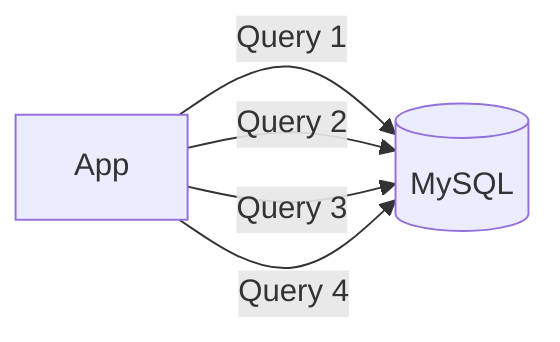
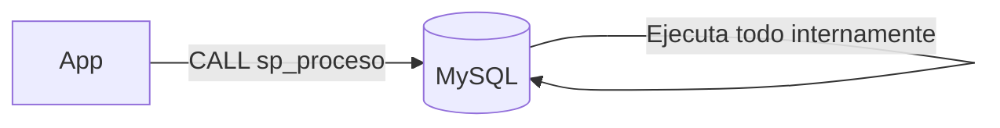
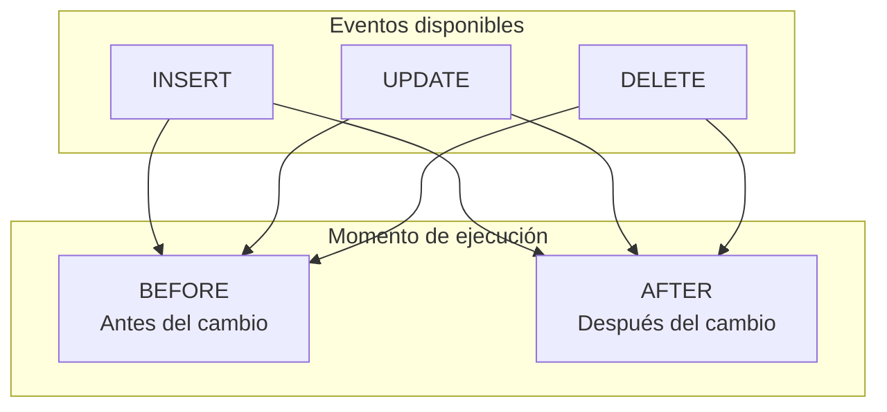
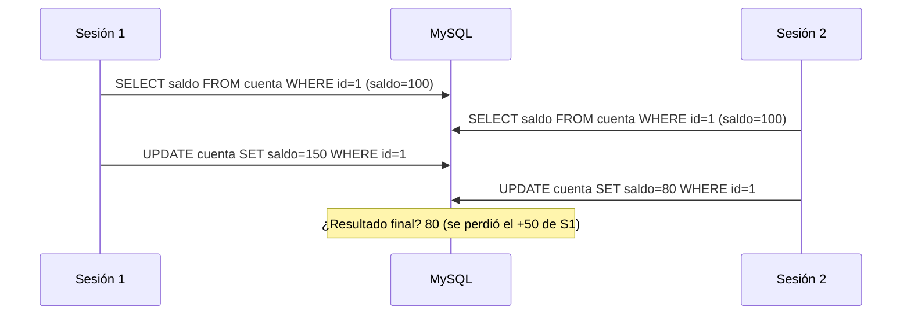
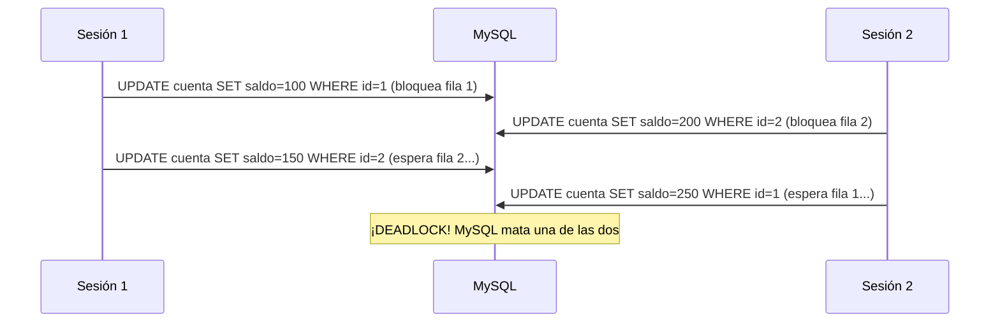

# Tema 5. Programación en la Base de Datos y Concurrencia (MySQL 8)

## 1. Procedimientos almacenados (Stored Procedures)

Un **procedimiento almacenado** es código SQL guardado en la base de datos que se ejecuta con `CALL`.

**Sin procedimiento** (múltiples bloques de código):



**Con procedimiento** (un solo bloque de código):



**Ventajas**:

- **Centralizar lógica**: Mismas reglas para todas las apps que usen la BD
- **Reducir viajes de red**: Una llamada en vez de múltiples queries
- **Transacciones coherentes**: Todo el proceso en una unidad atómica
- **Reutilización**: Llamar el mismo SP desde diferentes aplicaciones

**Desventajas**:

- **Acoplamiento al SGBD**: Difícil migrar a otro motor de BD
- **Debugging más difícil**: No tienes las herramientas de tu IDE
- **Versionado complejo**: Requiere disciplina para gestionar cambios

### 1.1. Sintaxis básica

```sql
-- Cambiar delimitador (necesario porque el SP contiene ";")
DELIMITER $$

CREATE PROCEDURE nombre_procedimiento(
  -- Parámetros
)
BEGIN
  -- Código SQL
END$$

DELIMITER ;

-- Ejecutar
CALL nombre_procedimiento();
```

### 1.2. Tipos de parámetros

| Tipo    | Dirección        | Uso                                       |
| ------- | ---------------- | ----------------------------------------- |
| `IN`    | Entrada          | Recibe valor de quien llama (por defecto) |
| `OUT`   | Salida           | Devuelve valor al llamador                |
| `INOUT` | Entrada y salida | Recibe y devuelve                         |

### 1.3. Ejemplo completo: crear alumno y devolver ID

```sql
DELIMITER $$

CREATE PROCEDURE sp_crear_alumno(
  IN  p_dni     VARCHAR(12),
  IN  p_nombre  VARCHAR(60),
  IN  p_email   VARCHAR(120),
  OUT p_id      INT
)
BEGIN
  -- Insertar el alumno
  INSERT INTO alumno (dni, nombre, email)
  VALUES (p_dni, p_nombre, p_email);

  -- Devolver el ID generado
  SET p_id = LAST_INSERT_ID();
END$$

DELIMITER ;
```

**Llamar al procedimiento**:

```sql
-- Declarar variable para recibir el OUT
CALL sp_crear_alumno('12345678A', 'Ana García', 'ana@uni.es', @nuevo_id);

-- Ver el resultado
SELECT @nuevo_id AS id_creado;
```

### 1.4. Ejemplo con transacción y control de errores

```sql
DELIMITER $$

CREATE PROCEDURE sp_transferir_creditos(
  IN p_id_origen  INT,
  IN p_id_destino INT,
  IN p_creditos   INT,
  OUT p_resultado VARCHAR(50)
)
BEGIN
  -- Declarar handler para errores
  DECLARE EXIT HANDLER FOR SQLEXCEPTION
  BEGIN
    ROLLBACK;
    SET p_resultado = 'ERROR: transacción cancelada';
  END;

  START TRANSACTION;

  -- Quitar créditos del origen
  UPDATE alumno
  SET creditos = creditos - p_creditos
  WHERE id_alumno = p_id_origen;

  -- Añadir créditos al destino
  UPDATE alumno
  SET creditos = creditos + p_creditos
  WHERE id_alumno = p_id_destino;

  COMMIT;
  SET p_resultado = 'OK: transferencia completada';
END$$

DELIMITER ;
```

### 1.5. Gestión de procedimientos

```sql
-- Ver procedimientos de un esquema
SHOW PROCEDURE STATUS WHERE Db = 'universidad';

-- Ver código de un procedimiento
SHOW CREATE PROCEDURE sp_crear_alumno;

-- Eliminar procedimiento
DROP PROCEDURE IF EXISTS sp_crear_alumno;
```

## 2. Triggers (disparadores)

Un **trigger** es código que se ejecuta **automáticamente** cuando ocurre un evento (INSERT, UPDATE, DELETE) en una tabla.

### 2.1. Tipos de triggers



| Momento  | Uso típico                                      |
| -------- | ----------------------------------------------- |
| `BEFORE` | Validar/modificar datos antes de que se guarden |
| `AFTER`  | Auditoría, actualizar tablas relacionadas       |

### 2.2. Variables especiales: OLD y NEW

| Variable | Disponible en  | Contiene                                  |
| -------- | -------------- | ----------------------------------------- |
| `NEW`    | INSERT, UPDATE | Valores nuevos (los que se van a guardar) |
| `OLD`    | UPDATE, DELETE | Valores anteriores (los que había)        |

```sql
-- En un UPDATE puedes comparar:
IF OLD.email <> NEW.email THEN
  -- El email ha cambiado
END IF;
```

### 2.3. Ejemplo: auditoría de cambios

**Tabla de auditoría**:

```sql
CREATE TABLE audit_alumno (
  id_audit   BIGINT       NOT NULL AUTO_INCREMENT,
  id_alumno  INT          NOT NULL,
  accion     ENUM('INSERT','UPDATE','DELETE') NOT NULL,
  campo      VARCHAR(50)  NULL,
  valor_old  VARCHAR(255) NULL,
  valor_new  VARCHAR(255) NULL,
  usuario    VARCHAR(100) NOT NULL,
  fecha      DATETIME     NOT NULL DEFAULT CURRENT_TIMESTAMP,
  PRIMARY KEY (id_audit)
) ENGINE=InnoDB;
```

**Trigger para auditar cambios de email**:

```sql
DELIMITER $$

CREATE TRIGGER trg_alumno_audit_update
AFTER UPDATE ON alumno
FOR EACH ROW
BEGIN
  -- Solo registrar si el email cambió
  IF NOT (OLD.email <=> NEW.email) THEN
    INSERT INTO audit_alumno (id_alumno, accion, campo, valor_old, valor_new, usuario)
    VALUES (NEW.id_alumno, 'UPDATE', 'email', OLD.email, NEW.email, USER());
  END IF;

  -- Auditar cambios de nombre
  IF NOT (OLD.nombre <=> NEW.nombre) THEN
    INSERT INTO audit_alumno (id_alumno, accion, campo, valor_old, valor_new, usuario)
    VALUES (NEW.id_alumno, 'UPDATE', 'nombre', OLD.nombre, NEW.nombre, USER());
  END IF;
END$$

DELIMITER ;
```

> **Nota**: El operador `<=>` es "NULL-safe equal". Devuelve TRUE si ambos son NULL o si son iguales.

### 2.4. Ejemplo: validación con BEFORE

```sql
DELIMITER $$

CREATE TRIGGER trg_alumno_validar_email
BEFORE INSERT ON alumno
FOR EACH ROW
BEGIN
  -- Validar formato de email (simplificado)
  IF NEW.email NOT LIKE '%@%.%' THEN
    SIGNAL SQLSTATE '45000'
    SET MESSAGE_TEXT = 'Email inválido: debe contener @ y dominio';
  END IF;

  -- Normalizar: convertir a minúsculas
  SET NEW.email = LOWER(NEW.email);
END$$

DELIMITER ;
```

### 2.5. Cuándo usar triggers (y cuándo NO)

| Usar triggers para                          | NO usar triggers para                   |
| ------------------------------------------- | --------------------------------------- |
| Auditoría automática                        | Lógica de negocio compleja              |
| Mantener campos calculados simples          | Operaciones que necesitan debugging     |
| Validaciones críticas que no deben saltarse | Llamadas a servicios externos           |
| Sincronizar tablas relacionadas             | Procesos que requieren versionado fácil |

### 2.6. Gestión de triggers

```sql
-- Ver triggers de una tabla
SHOW TRIGGERS FROM universidad WHERE `Table` = 'alumno';

-- Ver código de un trigger
SHOW CREATE TRIGGER trg_alumno_audit_update;

-- Eliminar trigger
DROP TRIGGER IF EXISTS trg_alumno_audit_update;
```

## 3. Cursores: procesar filas una a una

Un **cursor** permite recorrer el resultado de una consulta fila por fila dentro de un procedimiento almacenado.

**Usar cursores cuando**:

- Necesitas procesar cada fila con lógica diferente
- La operación no se puede expresar con un solo UPDATE/INSERT

**Evitar cursores cuando**:

- Puedes resolver con una sola sentencia SQL (más eficiente)

### 3.1. Sintaxis básica

```sql
DELIMITER $$

CREATE PROCEDURE sp_ejemplo_cursor()
BEGIN
  DECLARE v_id INT;
  DECLARE v_nombre VARCHAR(100);
  DECLARE fin BOOLEAN DEFAULT FALSE;

  DECLARE mi_cursor CURSOR FOR
    SELECT id_alumno, nombre FROM alumno;

  DECLARE CONTINUE HANDLER FOR NOT FOUND SET fin = TRUE;

  OPEN mi_cursor;

  bucle: LOOP
    FETCH mi_cursor INTO v_id, v_nombre;
    IF fin THEN LEAVE bucle; END IF;

    -- Procesar cada fila aquí
    SELECT CONCAT('Procesando: ', v_nombre);
  END LOOP;

  CLOSE mi_cursor;
END$$

DELIMITER ;
```

### 3.2. Ejemplo: listar alumnos

```sql
DELIMITER $$

CREATE PROCEDURE sp_listar_alumnos()
BEGIN
  DECLARE v_nombre VARCHAR(100);
  DECLARE fin BOOLEAN DEFAULT FALSE;

  DECLARE cur CURSOR FOR SELECT nombre FROM alumno;
  DECLARE CONTINUE HANDLER FOR NOT FOUND SET fin = TRUE;

  OPEN cur;

  leer: LOOP
    FETCH cur INTO v_nombre;
    IF fin THEN LEAVE leer; END IF;
    SELECT v_nombre AS alumno;
  END LOOP;

  CLOSE cur;
END$$

DELIMITER ;

-- Ejecutar
CALL sp_listar_alumnos();
```

### 3.3. Ejemplo: contar y mostrar total

```sql
DELIMITER $$

CREATE PROCEDURE sp_contar_activos()
BEGIN
  DECLARE v_id INT;
  DECLARE fin BOOLEAN DEFAULT FALSE;
  DECLARE total INT DEFAULT 0;

  DECLARE cur CURSOR FOR
    SELECT id_alumno FROM alumno WHERE activo = TRUE;
  DECLARE CONTINUE HANDLER FOR NOT FOUND SET fin = TRUE;

  OPEN cur;

  contar: LOOP
    FETCH cur INTO v_id;
    IF fin THEN LEAVE contar; END IF;
    SET total = total + 1;
  END LOOP;

  CLOSE cur;

  SELECT total AS alumnos_activos;
END$$

DELIMITER ;
```

### 3.4. Ejemplo: actualizar filas una a una

```sql
DELIMITER $$

CREATE PROCEDURE sp_aplicar_descuento()
BEGIN
  DECLARE v_id INT;
  DECLARE v_precio DECIMAL(10,2);
  DECLARE fin BOOLEAN DEFAULT FALSE;

  DECLARE cur CURSOR FOR
    SELECT id_producto, precio FROM producto;
  DECLARE CONTINUE HANDLER FOR NOT FOUND SET fin = TRUE;

  OPEN cur;

  actualizar: LOOP
    FETCH cur INTO v_id, v_precio;
    IF fin THEN LEAVE actualizar; END IF;

    -- Aplicar 10% descuento
    UPDATE producto
    SET precio = v_precio * 0.9
    WHERE id_producto = v_id;
  END LOOP;

  CLOSE cur;
END$$

DELIMITER ;
```

### 3.5. Patrón resumido

```sql
-- Estructura mínima de un cursor:

DECLARE variable TIPO;                              -- 1. Variables
DECLARE fin BOOLEAN DEFAULT FALSE;                  -- 2. Flag de fin
DECLARE mi_cursor CURSOR FOR SELECT ... FROM ...;  -- 3. Cursor
DECLARE CONTINUE HANDLER FOR NOT FOUND SET fin = TRUE;  -- 4. Handler

OPEN mi_cursor;                    -- 5. Abrir
LOOP
  FETCH mi_cursor INTO variable;   -- 6. Leer fila
  IF fin THEN LEAVE; END IF;       -- 7. Salir si no hay más
  -- procesar...                   -- 8. Tu lógica
END LOOP;
CLOSE mi_cursor;                   -- 9. Cerrar
```

> **Nota**: Siempre que puedas, usa un `UPDATE` o `INSERT ... SELECT` directo. Es más eficiente que un cursor.

## 4. Concurrencia: múltiples sesiones accediendo a los datos

La concurrencia ocurre cuando varias conexiones trabajan simultáneamente sobre los mismos datos.

### 4.1. El problema de la concurrencia



**Sin control de concurrencia**, las operaciones pueden "pisarse" entre sí.

### 4.2. Bloqueos (locks) en InnoDB

InnoDB usa bloqueos para coordinar el acceso concurrente:

| Tipo de bloqueo    | Qué permite                    | Cómo se obtiene                             |
| ------------------ | ------------------------------ | ------------------------------------------- |
| **Compartido (S)** | Múltiples lecturas simultáneas | `SELECT ... FOR SHARE`                      |
| **Exclusivo (X)**  | Solo una sesión puede escribir | `UPDATE`, `DELETE`, `SELECT ... FOR UPDATE` |

```sql
-- Lectura normal: NO bloquea (usa snapshot MVCC)
SELECT * FROM cuenta WHERE id = 1;

-- Lectura con bloqueo compartido (otras pueden leer, no escribir)
SELECT * FROM cuenta WHERE id = 1 FOR SHARE;

-- Lectura con bloqueo exclusivo (nadie más puede leer ni escribir)
SELECT * FROM cuenta WHERE id = 1 FOR UPDATE;
```

### 4.3. Transacciones: la solución

Una **transacción** agrupa operaciones en una unidad atómica: o se ejecutan todas, o ninguna.

```sql
START TRANSACTION;

-- Leer con bloqueo para evitar que otros modifiquen
SELECT saldo FROM cuenta WHERE id = 1 FOR UPDATE;

-- Modificar
UPDATE cuenta SET saldo = saldo + 50 WHERE id = 1;

-- Confirmar cambios
COMMIT;
```

**Si algo falla**:

```sql
ROLLBACK;  -- Deshace todos los cambios de la transacción
```

### 4.4. Niveles de aislamiento

MySQL soporta diferentes niveles de aislamiento (qué "ve" una transacción de otras):

| Nivel              | Qué permite ver                      | Uso típico                          |
| ------------------ | ------------------------------------ | ----------------------------------- |
| `READ UNCOMMITTED` | Cambios no confirmados de otros      | Casi nunca (datos "sucios")         |
| `READ COMMITTED`   | Solo cambios confirmados             | Común en otras BDs                  |
| `REPEATABLE READ`  | Snapshot al inicio de la transacción | **Por defecto en MySQL**            |
| `SERIALIZABLE`     | Máximo aislamiento, más bloqueos     | Cuando necesitas consistencia total |

```sql
-- Ver nivel actual
SELECT @@transaction_isolation;

-- Cambiar para la sesión
SET SESSION TRANSACTION ISOLATION LEVEL READ COMMITTED;
```

### 4.5. Problemas de concurrencia

| Problema        | Qué ocurre                                    | Solución                        |
| --------------- | --------------------------------------------- | ------------------------------- |
| **Dirty read**  | Leer datos no confirmados de otra transacción | Nivel READ COMMITTED o superior |
| **Lost update** | Dos transacciones sobrescriben el mismo dato  | `SELECT ... FOR UPDATE`         |
| **Deadlock**    | Dos transacciones esperan mutuamente          | Reintentar, ordenar accesos     |

### 4.6. Deadlocks: el bloqueo mutuo



**Cómo evitar deadlocks**:

```sql
-- Acceder siempre a las filas en el mismo orden (por PK)
START TRANSACTION;
UPDATE cuenta SET saldo = 100 WHERE id = 1;  -- Primero id menor
UPDATE cuenta SET saldo = 200 WHERE id = 2;  -- Luego id mayor
COMMIT;
```

### 4.7. Buenas prácticas de concurrencia

**Reglas de oro para concurrencia**:

1. **Transacciones CORTAS**: Menos tiempo = menos bloqueos
2. **Acceder a filas en ORDEN CONSISTENTE**: Evita deadlocks
3. **Usar ÍNDICES**: Bloquea menos filas
4. **NO hacer trabajo lento** dentro de transacciones
5. **Preparar REINTENTOS** para deadlocks

| Práctica                      | Por qué                                           |
| ----------------------------- | ------------------------------------------------- |
| Transacciones cortas          | Menos tiempo bloqueando = menos conflictos        |
| Orden consistente de acceso   | Evita deadlocks (todos acceden en el mismo orden) |
| Índices adecuados             | WHERE sin índice = bloqueo de muchas filas        |
| No llamar APIs externas en TX | Si la API tarda, la transacción bloquea más       |
| Reintentar en deadlock        | MySQL mata una TX, la app debe reintentar         |

### 4.8. Monitorizar bloqueos

```sql
-- Ver transacciones activas y bloqueos
SELECT * FROM information_schema.INNODB_TRX;

-- Ver bloqueos en espera
SELECT * FROM performance_schema.data_lock_waits;

-- Ver qué está bloqueando qué
SELECT
    waiting.THREAD_ID AS esperando,
    blocking.THREAD_ID AS bloqueando,
    waiting.OBJECT_NAME AS tabla
FROM performance_schema.data_lock_waits w
JOIN performance_schema.data_locks waiting ON w.REQUESTING_ENGINE_LOCK_ID = waiting.ENGINE_LOCK_ID
JOIN performance_schema.data_locks blocking ON w.BLOCKING_ENGINE_LOCK_ID = blocking.ENGINE_LOCK_ID;
```

## 5. Ejercicios propuestos

### Ejercicio 1: Stored procedures y triggers

1. Crea un procedimiento `sp_actualizar_email` que reciba `p_id INT` y `p_email VARCHAR(120)` y actualice el email de un alumno.
2. Añade un trigger `BEFORE UPDATE` sobre la tabla `alumno` que valide que el nuevo email tiene formato válido y lo convierta a minúsculas (similar al ejemplo visto).
3. Inserta algunos registros de prueba y llama al procedimiento para modificarlos. Comprueba que el trigger actúa correctamente y que el procedimiento devuelve el resultado esperado.
4. Ejecuta `SHOW CREATE PROCEDURE` y `SHOW CREATE TRIGGER` para documentar tu trabajo.

### Ejercicio 2: Cursores y concurrencia

1. Escribe un procedimiento `sp_incrementar_creditos_cursores` que use un cursor para sumar 1 crédito a todos los alumnos activos (campo `activo = TRUE`).
2. Convierte el procedimiento en uno que, en lugar de cursor, utilice un único `UPDATE` y compara las ventajas/desventajas de cada enfoque.
3. Simula dos sesiones concurrentes que intentan ejecutar el procedimiento al mismo tiempo. Observa qué tipo de bloqueos se generan (`INNODB_TRX`, `data_lock_waits`).
4. Repite el ejercicio forzando un deadlock cambiando el orden de acceso a filas en las transacciones y documenta cómo MySQL lo resuelve.
