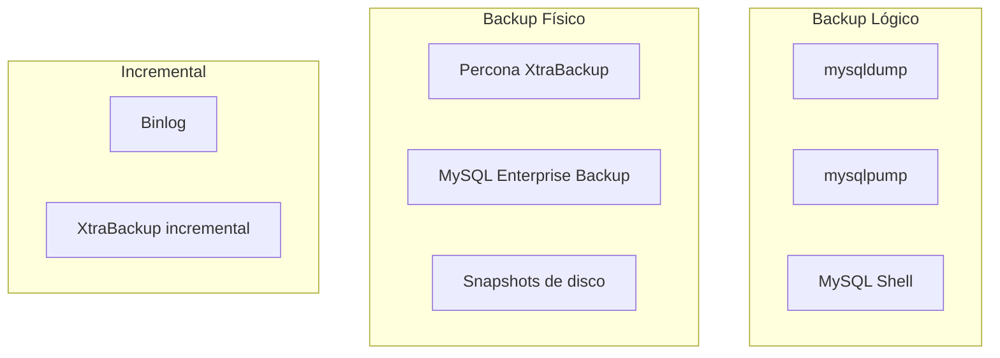
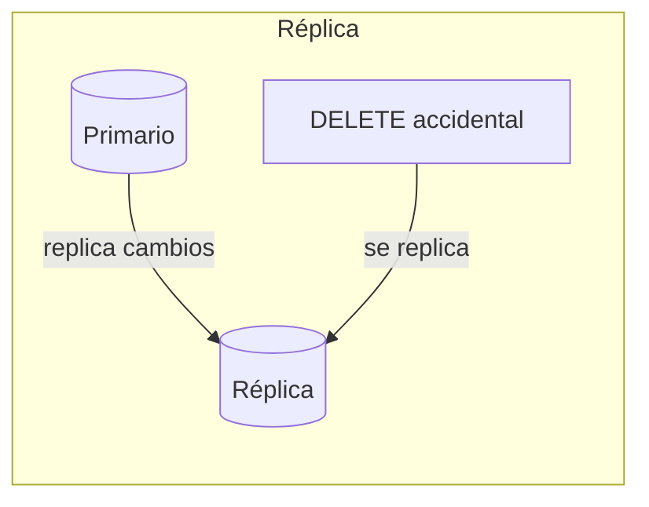

# Tema 6. Recuperación y Continuidad del Servicio

## 1. Conceptos fundamentales

### 1.1. Glosario esencial

| Concepto    | Qué es                                                      | Ejemplo                                |
| ----------- | ----------------------------------------------------------- | -------------------------------------- |
| **Backup**  | Copia de seguridad de datos y/o configuración               | `backup_universidad_2025-01-25.sql`    |
| **Restore** | Proceso de recuperar datos desde un backup                  | Cargar el `.sql` en MySQL              |
| **RPO**     | Recovery Point Objective: máxima pérdida de datos aceptable | "Podemos perder hasta 1 hora de datos" |
| **RTO**     | Recovery Time Objective: tiempo máximo para recuperar       | "Debemos estar online en 4 horas"      |
| **PITR**    | Point-in-Time Recovery: restaurar a un momento exacto       | Volver al estado de las 10:30:00       |
| **Binlog**  | Binary log: registro de todos los cambios                   | Necesario para replicación y PITR      |

### 1.2. RPO y RTO: definiendo la estrategia

```
                    FALLO
                      │
    ◄─────────────────┼─────────────────►
    │                 │                 │
    │      RPO        │       RTO       │
    │  (datos que     │   (tiempo sin   │
    │   se pierden)   │    servicio)    │
    │                 │                 │
────┴─────────────────┴─────────────────┴────► tiempo
Último               Fallo           Servicio
backup                               restaurado
```

| Métrica | Pregunta que responde             | Impacto en estrategia                 |
| ------- | --------------------------------- | ------------------------------------- |
| **RPO** | ¿Cuántos datos puedo perder?      | Define frecuencia de backups          |
| **RTO** | ¿Cuánto tiempo puedo estar caído? | Define tipo de backup y procedimiento |

**Ejemplo práctico**:

| Escenario        | RPO típico  | RTO típico | Estrategia                          |
| ---------------- | ----------- | ---------- | ----------------------------------- |
| Blog personal    | 24 horas    | 1-2 días   | Backup diario, restore manual       |
| E-commerce       | 1 hora      | 1-4 horas  | Backup + binlog, réplica standby    |
| Sistema bancario | 0 (ninguno) | Minutos    | Replicación síncrona, failover auto |

## 2. Tipos de backup

Antes de entrar en los detalles de cada método, recuerda que la elección depende del volumen de datos, la ventana de tiempo disponible y el RPO/RTO. Un esquema híbrido (backup completo + binlog + réplicas) suele ser la receta más segura.

### 2.1. Comparativa de métodos



| Tipo            | Qué copia                   | Velocidad backup | Velocidad restore | Portabilidad |
| --------------- | --------------------------- | ---------------- | ----------------- | ------------ |
| **Lógico**      | SQL (CREATE, INSERT...)     | Lento            | Lento             | Alta         |
| **Físico**      | Archivos de datos (.ibd)    | Rápido           | Rápido            | Baja         |
| **Incremental** | Solo cambios desde un punto | Muy rápido       | Complejo          | Variable     |

### 2.2. Backup lógico con mysqldump

`mysqldump` genera un archivo `.sql` con todas las instrucciones para recrear la BD.

**Opciones importantes**:

| Opción                  | Qué hace                                   | Cuándo usarla                |
| ----------------------- | ------------------------------------------ | ---------------------------- |
| `--single-transaction`  | Snapshot consistente sin bloquear (InnoDB) | **Siempre** con InnoDB       |
| `--routines`            | Incluye procedimientos y funciones         | Si tienes SPs                |
| `--triggers`            | Incluye triggers                           | Si tienes triggers           |
| `--events`              | Incluye eventos programados                | Si usas EVENT SCHEDULER      |
| `--databases`           | Incluye CREATE DATABASE                    | Para restore en BD vacía     |
| `--all-databases`       | Todas las bases de datos                   | Backup completo del servidor |
| `--set-gtid-purged=OFF` | No incluye info de GTID                    | Si no usas replicación GTID  |

**Ejemplo: backup de una base de datos**:

```bash
# Desde Docker
docker exec mysql8 mysqldump \
  -uroot -prootpass \
  --databases universidad \
  --single-transaction \
  --routines --triggers --events \
  --set-gtid-purged=OFF \
  > backup_universidad_$(date +%Y%m%d).sql
```

**Ejemplo: backup de todas las bases de datos**:

```bash
docker exec mysql8 mysqldump \
  -uroot -prootpass \
  --all-databases \
  --single-transaction \
  --routines --triggers --events \
  --set-gtid-purged=OFF \
  > backup_full_$(date +%Y%m%d).sql
```

**Ejemplo: backup de tablas específicas**:

```bash
docker exec mysql8 mysqldump \
  -uroot -prootpass \
  --single-transaction \
  universidad alumno profesor \
  > backup_tablas_$(date +%Y%m%d).sql
```

### 2.3. Backup físico (para grandes volúmenes)

Cuando tienes muchos GB/TB, el backup lógico es demasiado lento. El backup físico copia los archivos de datos directamente.

**Herramientas**:

| Herramienta             | Licencia    | Características                   |
| ----------------------- | ----------- | --------------------------------- |
| Percona XtraBackup      | Open source | El más usado, soporta incremental |
| MySQL Enterprise Backup | Comercial   | Integrado con MySQL Enterprise    |

**Concepto básico**:

```
1. XtraBackup copia los archivos .ibd mientras MySQL sigue funcionando
2. Captura los cambios del redo log durante la copia
3. "Prepara" el backup aplicando los cambios pendientes
4. Resultado: backup consistente sin parar MySQL
```

### 2.4. Backup incremental con binlog

El **binlog** registra todos los cambios (INSERT, UPDATE, DELETE). Combinado con un backup completo, permite PITR.

```
┌──────────────┐     ┌──────────────┐     ┌──────────────┐
│ Backup full  │     │   Binlog 1   │     │   Binlog 2   │
│  (domingo)   │ ──► │ (lun-mar)    │ ──► │ (mié-jue)    │
└──────────────┘     └──────────────┘     └──────────────┘
       │                    │                    │
       └────────────────────┴────────────────────┘
                           │
                    Restore completo
                    hasta cualquier
                    punto en el tiempo
```

## 3. Restauración (Restore)

### 3.1. Restore de backup lógico

```bash
# Restore básico
cat backup_universidad.sql | docker exec -i mysql8 mysql -uroot -prootpass

# O usando redirección
docker exec -i mysql8 mysql -uroot -prootpass < backup_universidad.sql
```

### 3.2. Verificación post-restore

```sql
-- Verificar que la BD existe
SHOW DATABASES;

-- Verificar tablas
USE universidad;
SHOW TABLES;

-- Verificar datos (conteos básicos)
SELECT 'alumno' AS tabla, COUNT(*) AS filas FROM alumno
UNION ALL
SELECT 'profesor', COUNT(*) FROM profesor
UNION ALL
SELECT 'asignatura', COUNT(*) FROM asignatura;

-- Verificar integridad de FKs
SELECT TABLE_NAME, CONSTRAINT_NAME, REFERENCED_TABLE_NAME
FROM information_schema.KEY_COLUMN_USAGE
WHERE TABLE_SCHEMA = 'universidad'
  AND REFERENCED_TABLE_NAME IS NOT NULL;
```

### 3.3. Checklist de restore

```
┌─────────────────────────────────────────────────────────────────┐
│                    CHECKLIST DE RESTORE                         │
├─────────────────────────────────────────────────────────────────┤
│  □ Verificar integridad del archivo backup (no corrupto)        │
│  □ Restaurar en entorno de TEST primero                         │
│  □ Comprobar que todas las tablas existen                       │
│  □ Verificar conteos de filas (comparar con backup)             │
│  □ Ejecutar queries críticas de negocio                         │
│  □ Verificar usuarios y permisos si aplica                      │
│  □ Documentar el proceso y tiempo empleado                      │
└─────────────────────────────────────────────────────────────────┘
```

## 4. PITR: Point-in-Time Recovery

PITR permite restaurar la BD a un **momento exacto** en el tiempo, combinando backup + binlog.

### 4.1. Requisitos para PITR

```sql
-- Verificar que binlog está activo
SHOW VARIABLES LIKE 'log_bin';           -- Debe ser ON
SHOW VARIABLES LIKE 'binlog_format';     -- Recomendado: ROW
SHOW VARIABLES LIKE 'binlog_expire_logs_seconds';  -- Retención

-- Ver binlogs disponibles
SHOW BINARY LOGS;
```

### 4.2. Escenario: recuperar de un DELETE accidental

```
Timeline:
─────────────────────────────────────────────────────────────────►
│                    │                    │
10:00               10:30                11:00
Backup              DELETE               Ahora
completo            accidental           (queremos volver a 10:29)
```

**Pasos**:

```bash
# 1. Restaurar el backup de las 10:00
cat backup_10_00.sql | docker exec -i mysql8 mysql -uroot -prootpass

# 2. Extraer cambios del binlog HASTA las 10:29 (antes del DELETE)
docker exec mysql8 mysqlbinlog \
  --start-datetime="2025-01-25 10:00:00" \
  --stop-datetime="2025-01-25 10:29:59" \
  /var/lib/mysql/binlog.000001 > cambios.sql

# 3. Aplicar los cambios
cat cambios.sql | docker exec -i mysql8 mysql -uroot -prootpass
```

### 4.3. Identificar el punto exacto en el binlog

```bash
# Ver contenido del binlog (buscar el DELETE problemático)
docker exec mysql8 mysqlbinlog \
  --start-datetime="2025-01-25 10:25:00" \
  --stop-datetime="2025-01-25 10:35:00" \
  /var/lib/mysql/binlog.000001 | grep -A5 -B5 "DELETE"
```

También puedes usar posiciones en vez de fechas:

```bash
# Aplicar hasta una posición específica
docker exec mysql8 mysqlbinlog \
  --start-position=154 \
  --stop-position=12345 \
  /var/lib/mysql/binlog.000001 > cambios.sql
```

## 5. Réplicas vs Backups

### 5.1. ¿Por qué una réplica NO es un backup?



| Aspecto             | Backup                             | Réplica                               |
| ------------------- | ---------------------------------- | ------------------------------------- |
| **Propósito**       | Recuperar datos perdidos           | Alta disponibilidad, escalar lecturas |
| **Errores humanos** | Protege (puedes restaurar)         | NO protege (se replican)              |
| **Corrupción**      | Protege (si el backup es anterior) | NO protege (se replica)               |
| **Latencia**        | Punto en el tiempo del backup      | Casi tiempo real                      |

> **Regla**: La réplica es para **disponibilidad**, el backup es para **recuperación**.

### 5.2. Snapshots de disco

Los snapshots capturan el estado del disco en un momento dado.

| Ventaja                     | Riesgo                               |
| --------------------------- | ------------------------------------ |
| Muy rápidos de crear        | Pueden capturar estado inconsistente |
| Muy rápidos de restaurar    | Requieren coordinación con MySQL     |
| Útiles para clonar entornos | Dependen de la infraestructura       |

**Para snapshots consistentes**:

```sql
-- Opción 1: Flush y lock (breve interrupción)
FLUSH TABLES WITH READ LOCK;
-- Tomar snapshot aquí
UNLOCK TABLES;

-- Opción 2: Usar herramientas que coordinan automáticamente
-- (XtraBackup, MySQL Enterprise Backup)
```

## 6. Bases de datos del sistema

Además de tus datos, hay información crítica del sistema:

| Base de datos        | Qué contiene                         | ¿Incluir en backup? |
| -------------------- | ------------------------------------ | ------------------- |
| `mysql`              | Usuarios, privilegios, configuración | **Sí** (crítico)    |
| `information_schema` | Metadatos (virtual, solo lectura)    | No (se regenera)    |
| `performance_schema` | Métricas de rendimiento              | No (se regenera)    |
| `sys`                | Vistas útiles sobre performance      | Opcional            |

```bash
# Backup incluyendo usuarios y privilegios
docker exec mysql8 mysqldump \
  -uroot -prootpass \
  --all-databases \
  --single-transaction \
  --routines --triggers --events \
  > backup_completo.sql
```

## 7. Automatización de backups

### 7.1. Script de backup con rotación

```bash
#!/bin/bash
# backup_mysql.sh

FECHA=$(date +%Y%m%d_%H%M%S)
BACKUP_DIR="/backups/mysql"
RETENTION_DAYS=7

# Crear backup
docker exec mysql8 mysqldump \
  -uroot -prootpass \
  --all-databases \
  --single-transaction \
  --routines --triggers --events \
  --set-gtid-purged=OFF \
  | gzip > "${BACKUP_DIR}/backup_${FECHA}.sql.gz"

# Verificar que se creó
if [ $? -eq 0 ]; then
  echo "Backup creado: backup_${FECHA}.sql.gz"
else
  echo "ERROR: Backup falló" >&2
  exit 1
fi

# Borrar backups antiguos
find ${BACKUP_DIR} -name "backup_*.sql.gz" -mtime +${RETENTION_DAYS} -delete
echo "Backups con más de ${RETENTION_DAYS} días eliminados"
```

### 7.2. Programar con cron

```bash
# Editar crontab
crontab -e

# Backup diario a las 3:00 AM
0 3 * * * /scripts/backup_mysql.sh >> /var/log/mysql_backup.log 2>&1
```

## 8. Ejercicios propuestos

1. **Planifica y realiza backups**
   - Elige un escenario (p. ej. microservicio con datos de usuarios) y define un RPO/RTO adecuado.
   - Genera un backup completo con `mysqldump` y otro físico (XtraBackup o similar). Comprueba tiempos de creación y restauración.
   - Restaura el backup en otra instancia y valida integridad de tablas y contadores.

2. **Simulación de desastre y PITR**
   - Crea un simple esquema con tablas y datos. Habilita binlog en formato ROW.
   - Realiza un backup completo y, después, ejecuta insert/updates durante varios minutos.
   - Forza una “borrada accidental” y recupera la base de datos hasta un punto anterior usando `mysqlbinlog`.
   - Documenta comandos usados y verifica que los datos coinciden con lo esperado.
