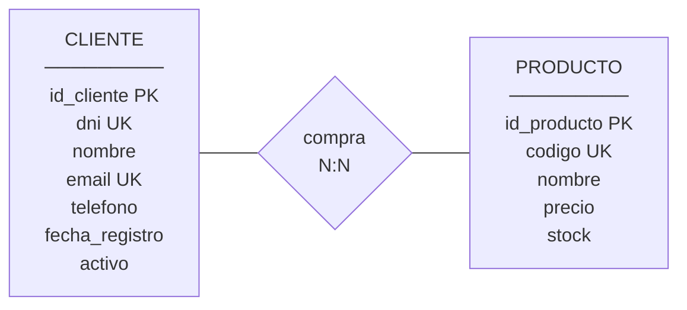

# LAB_1_A_antonordonez_javier

## Instrucciones

1. **Renombra este archivo** a `LAB_1_A_TusApellidos_TuNombre.md`
2. **Escribe tus respuestas SQL debajo de cada ejercicio** en el bloque indicado
3. Entrega este archivo `.md` con todas tus respuestas

> **⚠️ IMPORTANTE**: Está **prohibido** el uso de IA generativa (ChatGPT, Copilot, Claude, etc.). Se permite consultar apuntes y buscar información en Internet.

## Datos del alumno

- **Nombre completo**: javier Antón Ordóñez
- **Fecha**: 16 de Febrero 2026

## Modelo de **datos**: Tienda Online

Debes crear una base de datos para una tienda online con el siguiente modelo:



**Relación**:

- CLIENTE - PRODUCTO (N:N): Un cliente puede comprar muchos productos y un producto puede ser comprado por muchos clientes.

## Ejercicio 1: Creación de estructura (2 puntos)

### 1.1 Crear base de datos (0.5 puntos)

Crea la base de datos `tienda`.

```sql
-- TU RESPUESTA:
CREATE DATABASE tienda;
```

### 1.2 Crear tablas (1.5 puntos)

Crea todas las tablas necesarias según el modelo E-R.

```sql
-- TU RESPUESTA:
CREATE TABLE tienda.cliente (
  id_cliente      INT NOT NULL AUTO_INCREMENT,
  dni            VARCHAR(12) NOT NULL UNIQUE,
  nombre         VARCHAR(80) NOT NULL,
  email          VARCHAR(120) UNIQUE,
  telefono       VARCHAR(11) UNIQUE,
  fecha_registro     DATE NOT NULL DEFAULT (CURRENT_DATE),
  activo         BOOLEAN NOT NULL DEFAULT TRUE,
  PRIMARY KEY (id_cliente)
) ENGINE=InnoDB;
CREATE TABLE tienda.producto (
  id_producto    INT NOT NULL AUTO_INCREMENT,
  codigo         VARCHAR(12) NOT NULL UNIQUE,
  nombre         VARCHAR(120) NOT NULL,
  precio         DECIMAL(10,2),
  stock          SMALLINT,
  PRIMARY KEY (id_producto)
) ENGINE=InnoDB;
CREATE TABLE tienda.compra (
  id_compra      INT NOT NULL AUTO_INCREMENT,
  id_producto    INT NOT NULL,
  id_cliente     INT NOT NULL,
  cantidad       SMALLINT,
  CONSTRAINT fk_compra_producto
    FOREIGN KEY (id_producto)
    REFERENCES universidad.producto(id_producto)
    ON UPDATE CASCADE
    ON DELETE RESTRICT,
  CONSTRAINT fk_compra_cliente
    FOREIGN KEY (id_cliente)
    REFERENCES universidad.cliente(id_cliente)
    ON UPDATE CASCADE
    ON DELETE RESTRICT,
  UNIQUE (id_producto, id_cliente),
  PRIMARY KEY (id_compra)
) ENGINE=InnoDB;
```

## Ejercicio 2: Insertar datos (1 punto)

Inserta datos de prueba en todas las tablas:

```sql
-- TU RESPUESTA:
INSERT INTO tienda.cliente (dni, nombre, email, telefono)
VALUES
  ('12345678A', 'Ana Pérez', 'anas@uni.es', '34611406427'),
  ('12256026Q', 'Scott V. Desmarais', 'scott@gob.es', '4047260726'),
  ('Y4632442A', 'Ana Lopez', 'ana@uni.es', '+6463536249'),
  ('28867553T', 'Juan Fernandez', 'NoDoyMisDatos@Gmail.com', '+3474636273'),
  ('56100499A', 'Javier Anton Ordoñez', 'Javierantonordonez@gmail.com','+3412346789');
 
INSERT INTO tienda.producto (codigo, nombre, precio, stock)
VALUES
  ('PCA', 'PC ASUS', '1000', '5'),
  ('PCL', 'PC LENOVO', '1200', '4'),
  ('MnPC', 'Prodesk G6', '700', '20'),
  ('WOKSTA', 'WorkStation HP', '3000', '3'),
  ('Pro', 'Proyector Xiaomi', '100', '1'),
  ('APL', 'Iphone Pro Max', '200', '20');
  
INSERT INTO tienda.compra (id_producto, id_cliente, cantidad)
VALUES
  ('1','2','2'),
  ('2','3','2'),
  ('3','5','2'),
  ('1','8','2'),
  ('2','7','2');
  
```

## Ejercicio 3: Consultas de datos (3 puntos)

### 3.1 Consulta 1 (0.75 puntos)

Lista todos los productos con precio mayor a 50€, ordenados por precio descendente.

```sql
-- TU RESPUESTA:
SELECT * FROM tienda.producto AS p WHERE p.precio > "50" ORDER BY p.precio DESC;
```

### 3.2 Consulta 2 (1.25 puntos)

Muestra un listado de compras con:

- Nombre del cliente
- Nombre del producto
- Cantidad comprada
- Precio unitario
- Subtotal (cantidad × precio)

```sql
-- TU RESPUESTA:
SELECT c.nombre, p.nombre, p.stock, t.cantidad, p.precio, t.cantidad * p.precio
FROM tienda.compra as t
INNER JOIN tienda.cliente c on c.id_cliente = t.id_cliente
INNER JOIN tienda.producto p on p.id_producto = t.id_producto;
```

### 3.3 Consulta 3 (1 punto)

Muestra el total gastado por cada cliente.

```sql
-- TU RESPUESTA:
SELECT SUM(t.cantidad * p.precio) 
FROM tienda.compra as t
INNER JOIN tienda.cliente c on c.id_cliente = t.id_cliente
INNER JOIN tienda.producto p on p.id_producto = t.id_producto
GROUP BY c.id_cliente;
```

## Ejercicio 4: Administración del sistema (2 puntos)

### 4.1 Información del servidor (0.5 puntos)

Ejecuta los comandos para mostrar:

- La versión de MySQL
- El valor de `max_connections`
- Las variables relacionadas con `slow_query`

```sql
-- TU RESPUESTA:
SELECT VERSION();
SHOW VARIABLES LIKE 'max_connections';
SHOW VARIABLES LIKE 'slow_query_log%';
```

### 4.2 Tamaño de tablas (0.5 puntos)

Escribe una consulta que muestre el **tamaño en MB** de cada tabla de la base de datos `tienda`.

```sql
-- TU RESPUESTA:
SELECT
    table_name,
    ROUND(data_length / 1024 / 1024, 2) AS datos_MB
FROM information_schema.tables
WHERE table_schema = 'tienda';
```

### 4.3 Estado del servidor (0.5 puntos)

Muestra:

- El número de conexiones actuales (`Threads_connected`)
- El número total de consultas ejecutadas (`Questions`)
- El tiempo de actividad del servidor (`Uptime`)

```sql
-- TU RESPUESTA:
SHOW STATUS LIKE 'Threads_connected';
SHOW STATUS LIKE 'Connections';
SHOW STATUS LIKE 'Uptime';
```

### 4.4 Procesos activos (0.5 puntos)

Muestra la lista de procesos actualmente en ejecución en el servidor.

```sql
-- TU RESPUESTA:
SHOW PROCESSLIST;
```

## Ejercicio 5: Seguridad (2 puntos)

### 5.1 Crear usuarios (0.75 puntos)

Crea dos usuarios:

1. `app_tienda@'%'`: permisos SELECT, INSERT, UPDATE en `tienda.*`
2. `reportes@'localhost'`: solo permiso SELECT en `tienda.*`

```sql
-- TU RESPUESTA:
CREATE USER 'app_tienda'@'%' IDENTIFIED BY '1234';
CREATE USER 'reportes'@'localhost' IDENTIFIED BY '1234';

GRANT SELECT, INSERT, UPDATE ON tienda.* TO 'app_tienda'@'%';
GRANT SELECT ON tienda.* TO 'reportes'@'localhost';

```

### 5.2 Crear vista para enmascarar datos (0.5 puntos)

Crea una vista `v_clientes_anonimos` que muestre solo `id_cliente`, `nombre` y `fecha_registro` (ocultando dni, email y teléfono).

```sql
-- TU RESPUESTA:
CREATE VIEW v_clientes_anonimos AS
SELECT id_cliente, nombre, fecha_registro
FROM tienda.cliente;
```

### 5.3 Gestión de permisos (0.75 puntos)

1. Revoca el acceso del usuario `reportes` a la tabla `cliente`
2. Dale acceso solo a la vista `v_clientes_anonimos`
3. Ejecuta `SHOW GRANTS FOR 'reportes'@'localhost'`

Responde: ¿Puede el usuario `reportes` ver el email de los clientes? Justifica tu respuesta.

```sql
-- TU RESPUESTA (SQL):
REVOKE SELECT ON tienda.* FROM 'reportes'@'localhost';
GRANT SELECT ON tienda.producto TO 'reportes'@'localhost';
GRANT SELECT ON tienda.compra TO 'reportes'@'localhost';

GRANT SELECT ON tienda.v_clientes_anonimos TO 'reportes'@'localhost'

-- Resultado de SHOW GRANTS:
GRANT USAGE ON *.* TO `reportes`@`localhost`
GRANT SELECT ON `tienda`.`compra` TO `reportes`@`localhost`
GRANT SELECT ON `tienda`.`producto` TO `reportes`@`localhost`
GRANT SELECT ON `tienda`.`v_clientes_anonimos` TO `reportes`@`localhost`
-- Respuesta justificada:
No por que se le ha ocultado esa informacion solo se le permite ver el id el nombre y la fecha de registro
```
