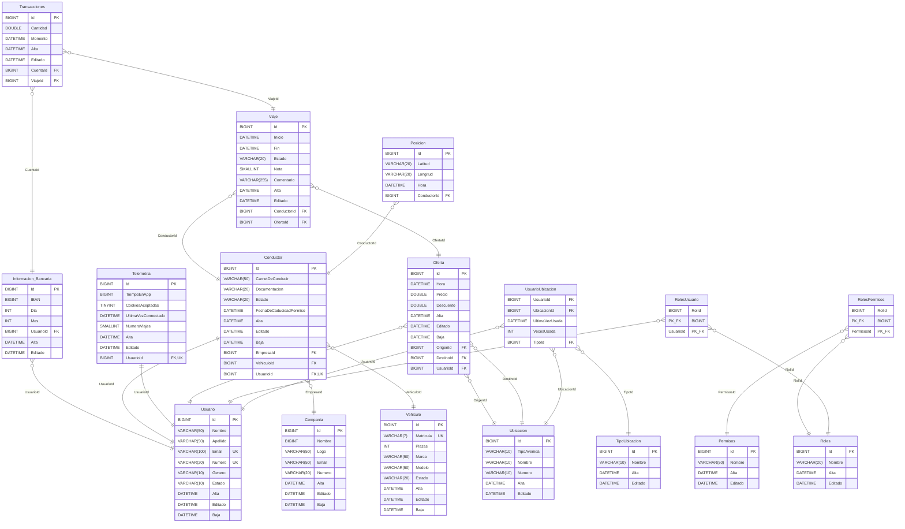

# Diseño de base de datos.

## Indice
1. [Diseño Entidad Relación](#diseño-entidad-relación)
2. [Tablas](#tablas)
3. [Relaciones](#relaciones)

## Diseño Entidad Relación.

## Tablas.

### Usuario
   Esta es la tabla de usuario del sistema.
   Campos:
   - Id: Identificador en el sistema.
   - Nombre: Nombre del usuario.
   - Apellido: Apellido del usuario.
   - Email: Email del usuario.
   - Numero: Numero de teléfono del usuario.
   - Genero: Genero del usuario Hombre/Mujer/otro.
   - Estado: Estado del usuario en el sistema.
   - Alta: Fecha de alta del usuario.
   - Editado: Fecha de última edición.
   - Baja: Fecha de baja del usuario.
### Información Bancaria
   Tabla de la información bancaria de un usuario para hacer pagos y para sacar dinero.
   Campos:
   - Id: Identificador en el sistema.
   - IBAN: Es el IBAN de la cuenta.
   - Día: Es el día de caducidad de la tarjeta
   - Mes: Es el mes de caducidad de la cuenta.
   - UsuarioId: Foreign Key que referencia al usuario de quien es la cuenta.
   - Alta: Fecha de alta de la cuenta.
   - Editado: Fecha de última edición.
### Roles
   Tabla de roles de la aplicación (Conductor, Pasajero, Administrador, Desarrollador).
   Campos.
   - Id: Identificador en el sistema.
   - Nombre: Nombre del rol.
   - Alta: Fecha de alta del rol.
   - Editado: Fecha de última edición.
### Permisos
   Tabla de permisos, si un rol solo tiene acceso a los permisos que se le asigne.
   Campos:
   - Id: Identificador en el sistema.
   - Nombre: Nombre del permiso.
   - Alta: Fecha de alta del permiso.
   - Editado: Fecha de última edición.
### Telemetría
   Tabla de información captada de uso de la aplicación.
   Campos:
   - Id: Identificador en el sistema.
   - TiempoEnApp: El tiempo que el usuario ha invertido en la aplicación.
   - CookiesAceptadas: Si a aceptado o declinado las cookies.
   - UltimaVezConnectado: La fecha y hora de ultima vez entrado en la aplicación.
   - NumeroViajes: Numero de viajes que ha solicitado un viaje.
   - Alta: Fecha de alta del registro.
   - Editado: Fecha de última edición.
   - UsuarioId: El usuario del cual se ha recolectado esta información.
### Ubicaciones
   Tabla de direcciones o lugares utilizados como origen, destino o ubicaciones guardadas por los usuarios.
   Campos:
   - Id: Identificador de la ubicación.
   - TipoAvenida: Tipo de via (calle, avenida, etc.).
   - Nombre: Nombre de la calle o lugar.
   - Numero: Numero de la dirección.
   - Alta: Fecha en la que se añadió la ubicación.
   - Editado: Fecha de última edición.
### Oferta
   Tabla de solicitudes de viaje creadas por los usuarios.
   Campos:
   - Id: Identificador de la oferta.
   - Hora: hora de la solicitud.
   - Precio: Precio estimado de la solicitud.
   - Descuento: Descuento aplicado.
   - Alta: Fecha de alta de la oferta.
   - Editado: Fecha de última edición.
   - Baja: Fecha de baja de la oferta.
   - OrigenId: Ubicación de origen.
   - DestinoId: Ubicación de destino.
   - UsuarioId: Usuario que solicita el viaje.
### Viaje
   Tabla de viajes realizados en la plataforma a partir de una oferta.
   Campos:
   - Id: Identificador del viaje.
   - Inicio: Fecha y hora de inicio del viaje.
   - Fin: Fecha y hora de finalización del viaje.
   - Estado: Estado del viaje.
   - Nota: Calificación del viaje.
   - Comentario: Comentario asociado al viaje.
   - Alta: Fecha de alta del viaje.
   - Editado: Fecha de última edición.
   - ConductorId: Conductor que realiza el viaje.
   - OfertaId: Oferta asociada al viaje.
### Conductor
   Tabla de conductores registrados en la plataforma.
   Campos:
   - Id: Identificador del conductor.
   - CarnetDeConducir: Ubicación del fichero del carnet de conducir.
   - Documentacion: Documentación de identidad asociada al conductor.
   - Estado: Estado del conductor.
   - FechaDeCaducidadPermiso: Fecha de caducidad del permiso de conducir.
   - Alta: Fecha de alta del conductor.
   - Editado: Fecha de última edición.
   - Baja: Fecha de baja del conductor.
   - EmpresaId: compañía asociada al conductor.
   - VehiculoId: vehículo asociado al conductor.
   - UsuarioId: Usuario asociado al conductor.
### Vehículo
   Tabla de vehículos disponibles en la plataforma para realizar viajes.
   Campos:
   - Id: Identificador del vehículo.
   - Matricula: Matricula del vehículo.
   - Plazas: Numero de plazas del vehículo.
   - Marca: Marca del vehículo.
   - Modelo: Modelo del vehículo.
   - Estado: Estado del vehículo.
   - Alta: Fecha de alta del vehículo.
   - Editado: Fecha y hora de la ultima actualización.
   - Baja: Fecha y hora de baja del vehículo.
### Compañía
   Tabla de compañías asociadas a conductores
   Campos:
   - Id: Identificador de la compañía.
   - Nombre: Nombre de la de la compañía.
   - Logo: Logo de la compañía, guardado en la url de la imagen.
   - Email: Correo electrónico de la compañía.
   - Numero: Numero de contacto de la compañía.
   - Alta: Fecha de alta de la compañía.
   - Editado: Fecha de última edición.
   - Baja: Fecha de baja de la compañía.
### Posicion
   Tabla de la posición en tiempo real de un conductor.
   Campos:
   - Id: Identificador del campo en la base de datos.
   - Latitud: Latitud de la posición.
   - Longitud: Longitud de la posición.
   - Hora: La hora a la que se ha cogido.
   - ConductorId: Id del conductor a que refiere esta ubicación.
### Transacciones
   Tabla de pagos registrados en el sistema.
   Campos:
   - Id: Identificador de la transacción.
   - Cantidad: Importe de la transacción.
   - Momento: Fecha y hora en la que se realizo la transacción.
   - Alta: Fecha de alta de la transacción.
   - Editado: Fecha de última edición.
   - CuentaId: Cuenta bancaria asociada a la transacción.
   - ViajeId: Viaje asociado a la transacción.

## Relaciones.

### Vehículo-Conductor
   Un conductor puede tener asignado un vehículo. Si el vehículo se elimina, el campo VehiculoId del conductor se establece a NULL.
   Campos relacionados:
   - VehiculoId: Foreign Key en la tabla Conductor que referencia a Vehiculo(Id).
### Conductor-Compañía 
   Un conductor puede pertenecer a una compañía. Una compañía puede tener múltiples conductores asociados.
   Campos relacionados:
   - EmpresaId: Foreign Key en la tabla Conductor que referencia a Compania(Id).
### Conductor-Ubicación
   Un conductor puede tener múltiples registros de posición. Si se elimina el conductor, también se eliminan sus posiciones.
   Campos relacionados:
   - ConductorId: Foreign Key en la tabla Posicion que referencia a Conductor(Id).
### Conductor-Viaje
   Un conductor puede realizar múltiples viajes. No se permite eliminar un conductor si tiene viajes asociados.
   Campos relacionados:
   - ConductorId: Foreign Key en la tabla Viaje que referencia a Conductor(Id).
### Transacciones-Viaje
   Cada transacción está asociada a un viaje. No se puede eliminar un viaje si tiene transacciones.
   Campos relacionados:
   - ViajeId: Foreign Key en la tabla Transacciones que referencia a Viaje(Id).
### Oferta-Viaje
   Cada viaje proviene de una oferta. No se puede eliminar una oferta si está asociada a un viaje.
   Campos relacionados:
   - OfertaId: Foreign Key en la tabla Viaje que referencia a Oferta(Id).
### Ubicaciones-Oferta
   Cada oferta tiene una ubicación de origen y una de destino. No se puede eliminar una ubicación si está siendo utilizada.
   Campos relacionados:
   - OrigenId: Foreign Key en la tabla Oferta → Ubicacion(Id)
   - DestinoId: Foreign Key en la tabla Oferta → Ubicacion(Id)
### Usuario-Oferta
   Un usuario puede crear múltiples ofertas. No se puede eliminar un usuario si tiene ofertas.
   Campos relacionados:
   - UsuarioId: Foreign Key en la tabla Oferta que referencia a Usuario(Id).
### Usuario-Telemetría
   Cada usuario tiene un único registro de telemetría. Si el usuario se elimina, su telemetría también.
   Campos relacionados:
   - UsuarioId: Foreign Key en la tabla Telemetria (único) → Usuario(Id).
### Usuario-Información-bancaria
   Un usuario puede tener varias cuentas bancarias. Si el usuario se elimina, sus cuentas también.
   Campos relacionados:
   - UsuarioId: Foreign Key en la tabla Informacion_Bancaria → Usuario(Id).
### Usuario-Roles
   Un usuario puede tener múltiples roles. Si se elimina un usuario, se eliminan sus roles asociados. No se puede eliminar un rol si está en uso.
   Campos relacionados:
   - UsuarioId: Foreign Key en RolesUsuario → Usuario(Id)
   - RolId: Foreign Key en RolesUsuario → Roles(Id)
### Roles-Permisos
   Un rol tiene varios permisos. No se pueden eliminar roles ni permisos si están siendo utilizados.
   Campos relacionados:
   - RolId: Foreign Key en RolesPermisos → Roles(Id)
   - PermisosId: Foreign Key en RolesPermisos → Permisos(Id)

