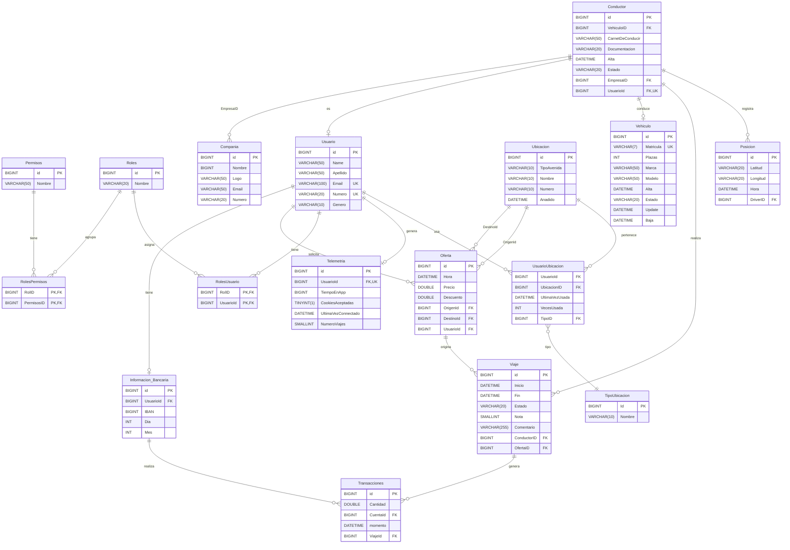

# Diagrama de Base de Datos - Schema

```mermaid
erDiagram
    Permisos {
        BIGINT id PK
        VARCHAR(50) Nombre
    }
    
    Informacion_Bancaria {
        BIGINT id PK
        BIGINT UsuarioId FK
        BIGINT IBAN
        INT Dia
        INT Mes
    }
    
    Roles {
        BIGINT id PK
        VARCHAR(20) Nombre
    }
    
    Viaje {
        BIGINT id PK
        DATETIME Inicio
        DATETIME Fin
        VARCHAR(20) Estado
        SMALLINT Nota
        VARCHAR(255) Comentario
        BIGINT ConductorID FK
        BIGINT OfertaID FK
    }
    
    TipoUbicacion {
        BIGINT Id PK
        VARCHAR(10) Nombre
    }
    
    Vehiculo {
        BIGINT id PK
        VARCHAR(7) Matricula UK
        INT Plazas
        VARCHAR(50) Marca
        VARCHAR(50) Modelo
        DATETIME Alta
        VARCHAR(20) Estado
        DATETIME Update
        DATETIME Baja
    }
    
    Usuario {
        BIGINT id PK
        VARCHAR(50) Name
        VARCHAR(50) Apellido
        VARCHAR(100) Email UK
        VARCHAR(20) Numero UK
        VARCHAR(10) Genero
    }
    
    Ubicacion {
        BIGINT id PK
        VARCHAR(10) TipoAvenida
        VARCHAR(10) Nombre
        VARCHAR(10) Numero
        DATETIME Anadido
    }
    
    UsuarioUbicacion {
        BIGINT UsuarioId FK
        BIGINT UbicacionID FK
        DATETIME UltimaVezUsada
        INT VecesUsada
        BIGINT TipoID FK
    }
    
    RolesPermisos {
        BIGINT RolID PK,FK
        BIGINT PermisosID PK,FK
    }
    
    Conductor {
        BIGINT id PK
        BIGINT VehiculoID FK
        VARCHAR(50) CarnetDeConducir
        VARCHAR(20) Documentacion
        DATETIME Alta
        VARCHAR(20) Estado
        BIGINT EmpresaID FK
        BIGINT UsuarioId FK,UK
    }
    
    Telemetria {
        BIGINT id PK
        BIGINT UsuarioId FK,UK
        BIGINT TiempoEnApp
        TINYINT(1) CookiesAceptadas
        DATETIME UltimaVezConnectado
        SMALLINT NumeroViajes
    }
    
    Transacciones {
        BIGINT id PK
        DOUBLE Cantidad
        BIGINT CuentaId FK
        DATETIME momento
        BIGINT ViajeId FK
    }
    
    Oferta {
        BIGINT id PK
        DATETIME Hora
        DOUBLE Precio
        DOUBLE Descuento
        BIGINT OrigenId FK
        BIGINT DestinoId FK
        BIGINT UsuarioId FK
    }
    
    Compania {
        BIGINT id PK
        BIGINT Nombre
        VARCHAR(50) Logo
        VARCHAR(50) Email
        VARCHAR(20) Numero
    }
    
    RolesUsuario {
        BIGINT RolID PK,FK
        BIGINT UsuarioId PK,FK
    }
    
    Posicion {
        BIGINT id PK
        VARCHAR(20) Latitud
        VARCHAR(20) Longitud
        DATETIME Hora
        BIGINT DriverID FK
    }
    
    %% Relaciones
    Conductor ||--o{ Compania : "EmpresaID"
    Usuario ||--o| Informacion_Bancaria : "tiene"
    Ubicacion ||--o{ Oferta : "DestinoId"
    Ubicacion ||--o{ Oferta : "OrigenId"
    Usuario ||--o{ Oferta : "solicita"
    Permisos ||--o{ RolesPermisos : "tiene"
    Roles ||--o{ RolesPermisos : "agrupa"
    Roles ||--o{ RolesUsuario : "asigna"
    Usuario ||--o{ RolesUsuario : "tiene"
    Usuario ||--o| Telemetria : "genera"
    UsuarioUbicacion }o--|| TipoUbicacion : "tipo"
    Informacion_Bancaria ||--o{ Transacciones : "realiza"
    Viaje ||--o{ Transacciones : "genera"
    Conductor ||--o| Usuario : "es"
    Ubicacion ||--o{ UsuarioUbicacion : "pertenece"
    Usuario ||--o{ UsuarioUbicacion : "usa"
    Conductor ||--o| Vehiculo : "conduce"
    Conductor ||--o{ Viaje : "realiza"
    Oferta ||--o{ Viaje : "origina"
    Conductor ||--o{ Posicion : "registra"
```
